# Task 1.2

1. Install GIT on your workstation.
2. Setup git: change your global configs (add name and email, setup core text editor).
3. Create account on GitHub.
4. Create new privaterepo on GitHub.Repo name:DevOps_online_Lviv_2020Q3Q4
5. You can see example repository structure.
  m1/
    task1.1/
    task1.2/
  m2/
    task2.1/
    task2.2/
    ...
  ...
  m8/
    task8.1/
    task8.2/
    ...
6. Clone repo to your workstation.
7. Open git console in root directory of your project and make next steps.

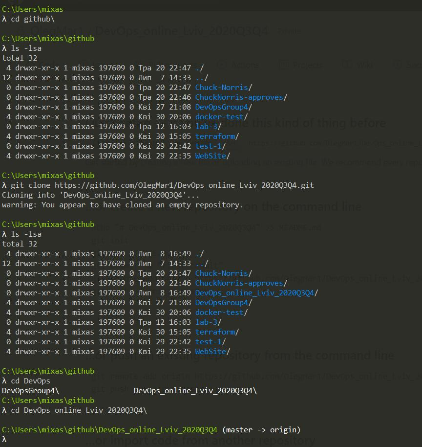
---
8. Do all your experiments in folder “task1.2”.
9. Create empty readme.txt file.
10. Make init commit.

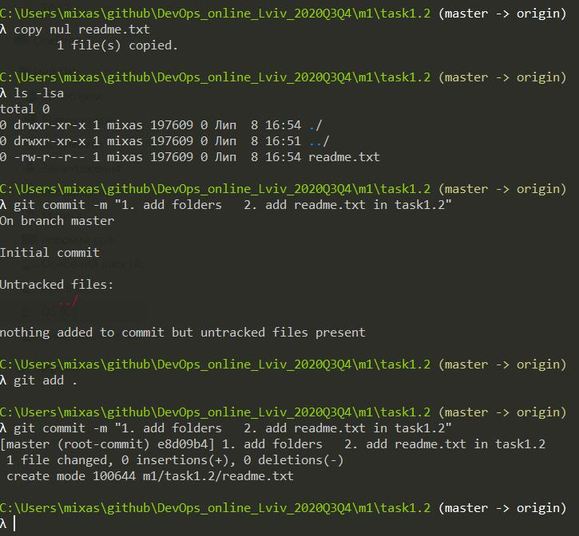
---
11. Create develop branch and checkout on it.
12. Create index.html empty file. Commit.

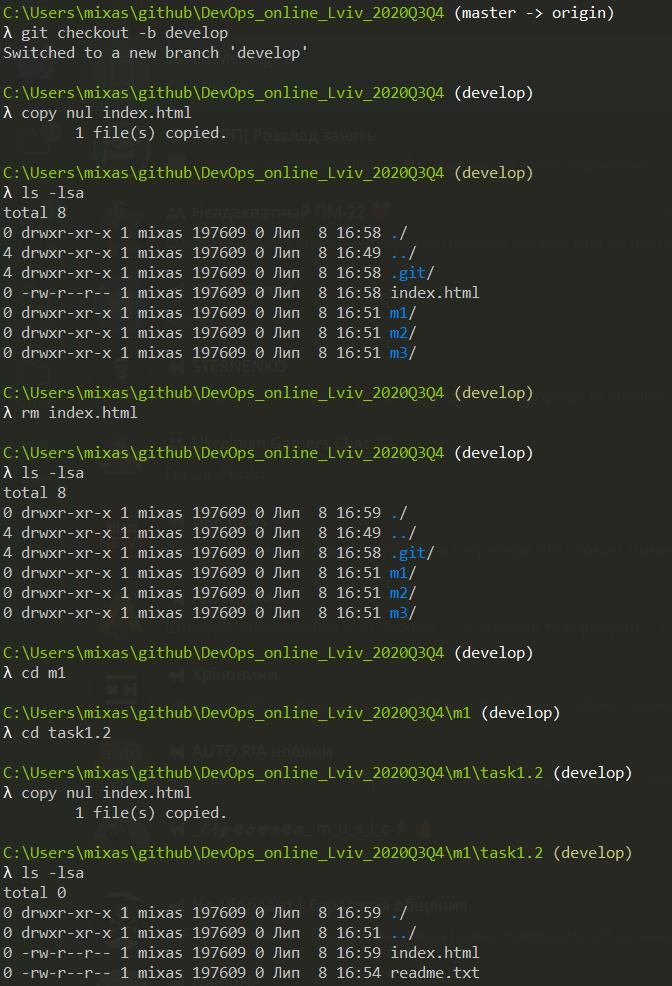
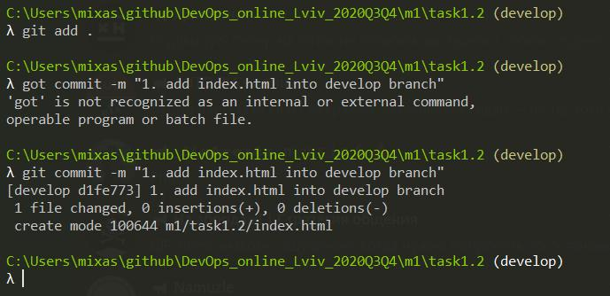
---
13. Create branch with name “images”. Checkout on it. Add images folder with some images inside it. Commit.

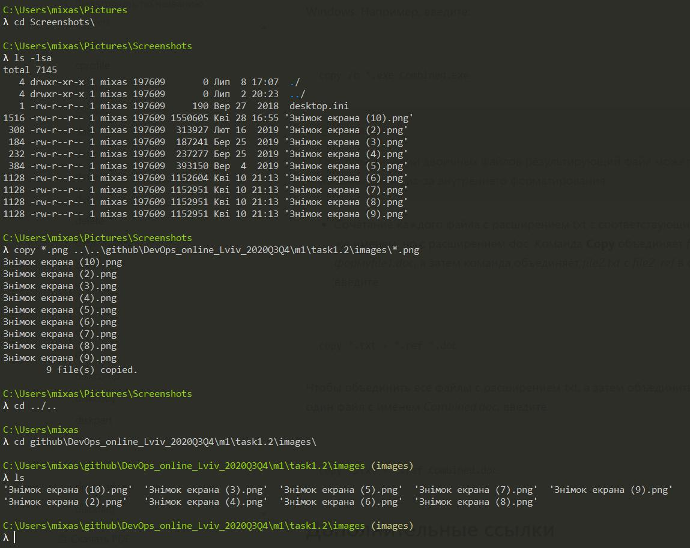
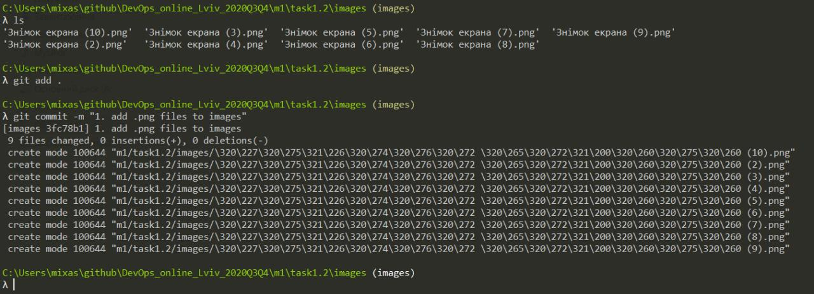
---
14. Change your index.html. Add images source inside it. Commit.

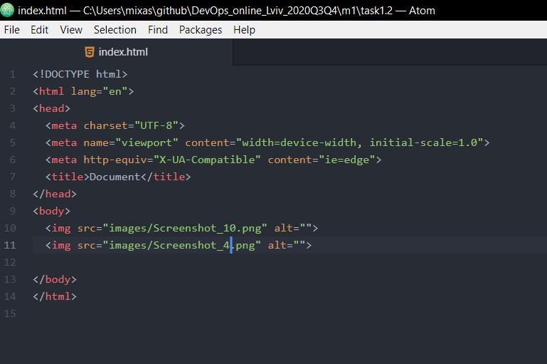
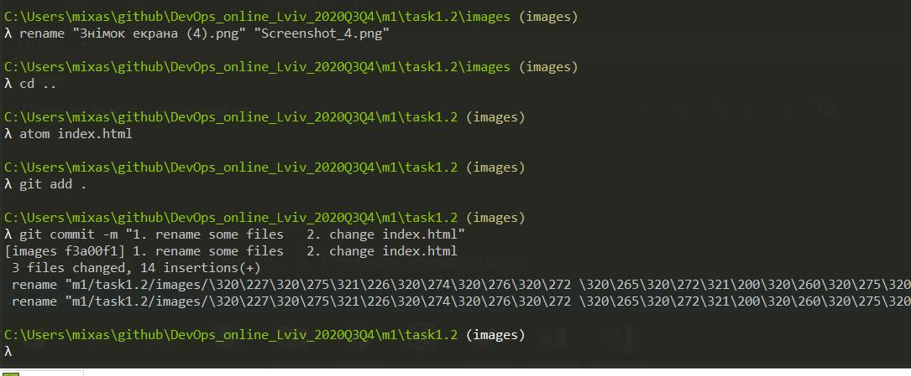
---
15. Go back to develop branch.
16. Create branch with name “styles”. Checkouton it.Add styles folder with styles source insideit. Commit.

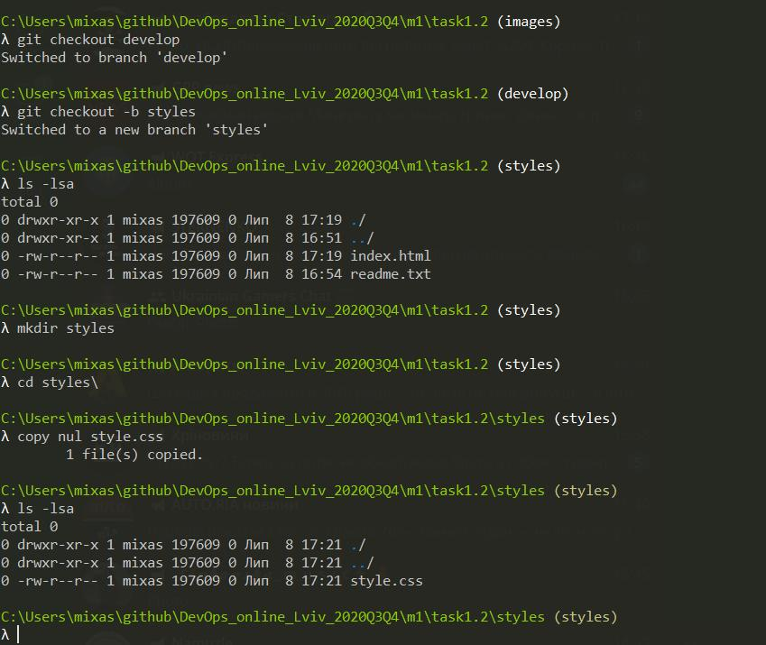
---
17. Change your index.html. Commit.

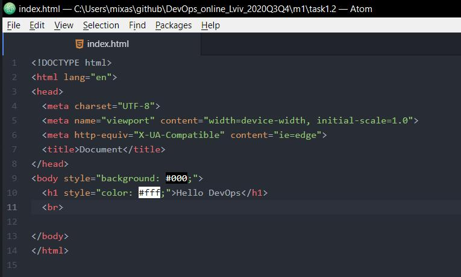
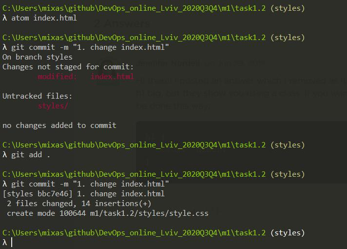
---
18. Go to develop branch.
19. Merge two new branches into develop using git merge command. Resolve conflict if it appear.Do it in next sequence:•merge “images” into “develop”•merge “styles” into “develop”

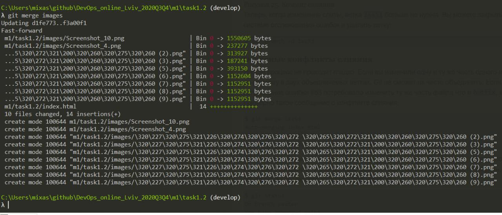

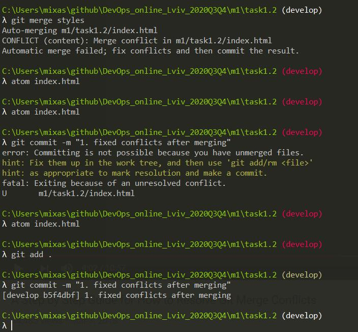

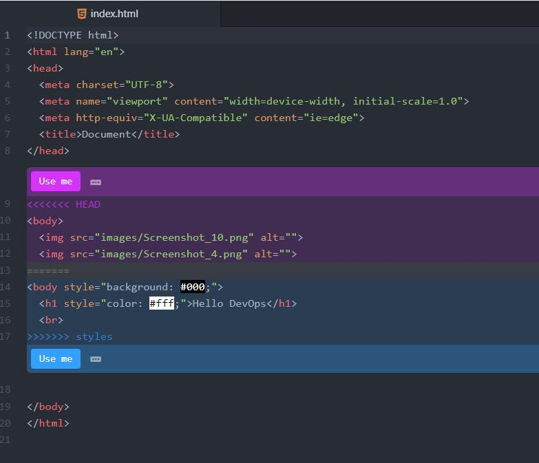

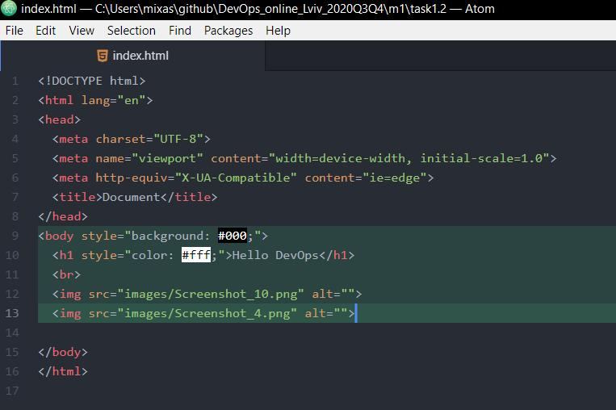

---
20. Do not delete any branches!
21. Merge develop into master.

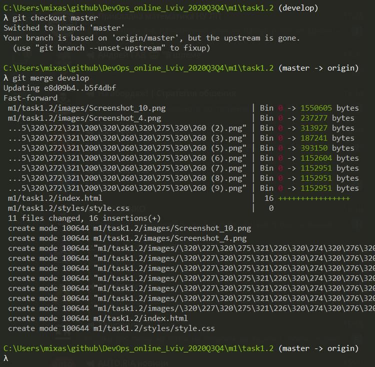
---
22. Try to inspect your repository with git log command. Use different options with this command (git log --help).

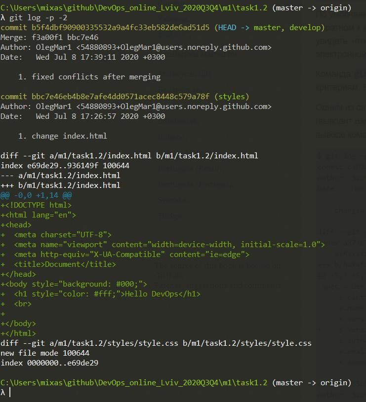
---
23. Push all your changes with allyour branches toorigin(git push origin --all).

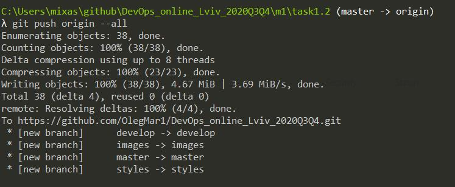
---
24. Execute command “git reflog“ and save it content somewhere (not in repository) with filename “task1.2_GIT.txt”.

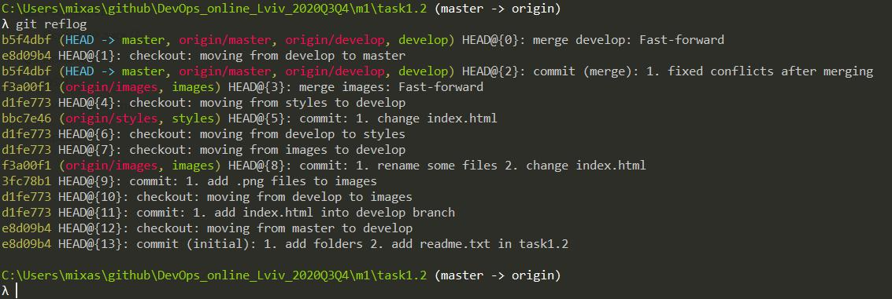
---
25. Add in repository your trainers (ask their email) as collaborators.

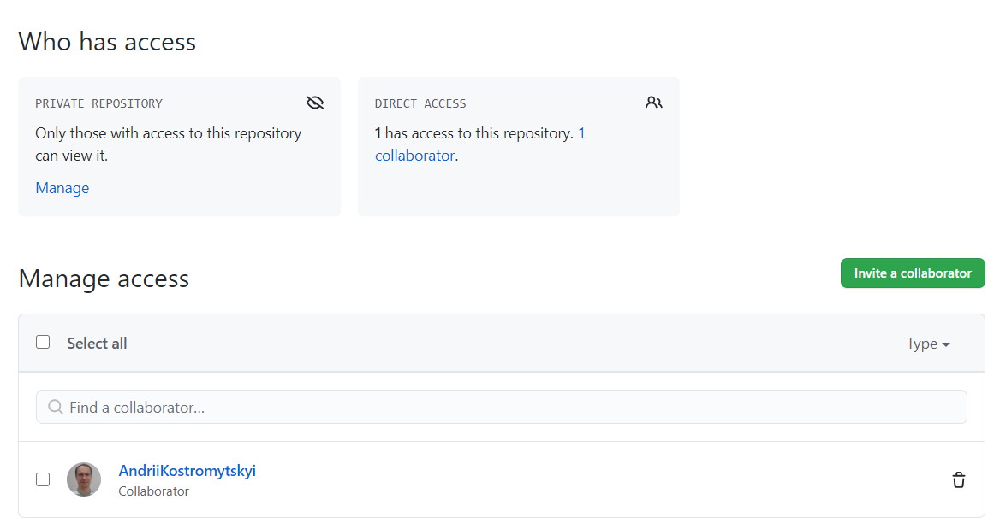
---
26. Add task1.2_GIT.txt to your local repo in then Push it in GitHubrepo.

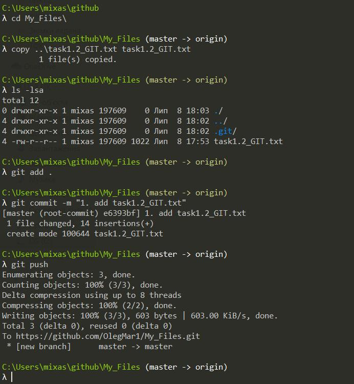
---
27. Make file readme.md  in folder task1.2 and describe results of your work with Git.
 
