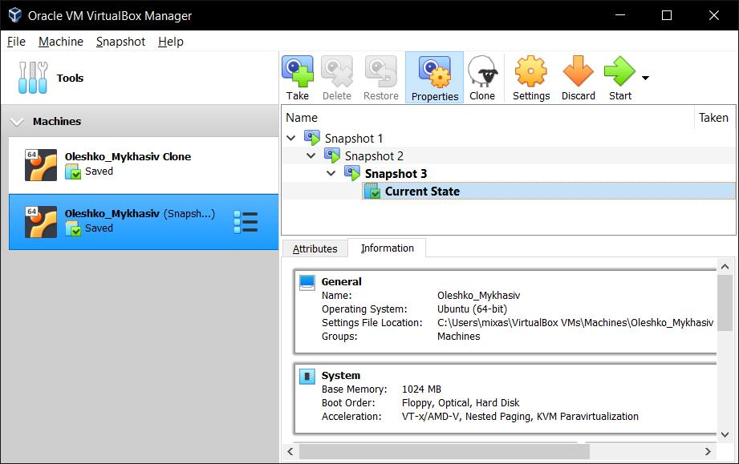
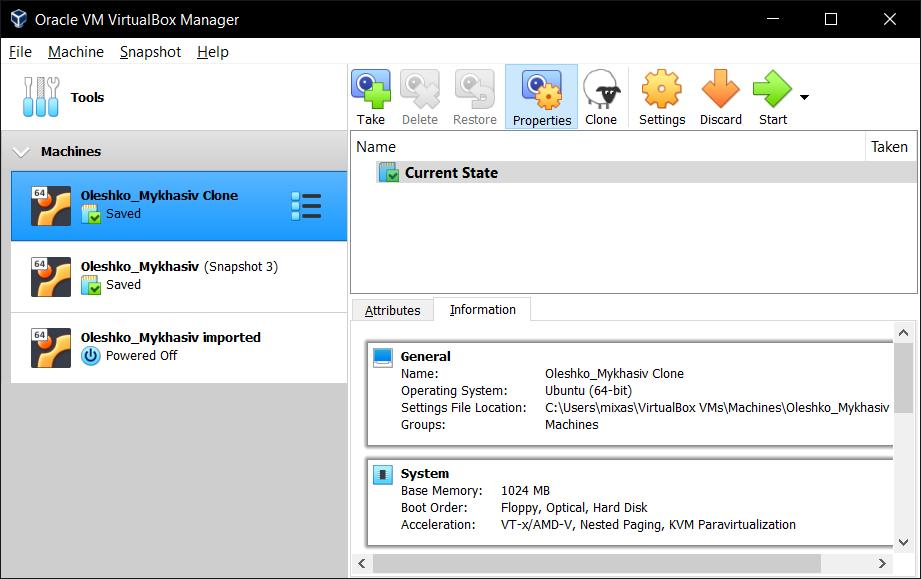

# __TASK 2.2__
## __PART 1. WORK VITH VIRTUALBOX__
#### __1.First run VirtualBox and Virtual Machine(VM).__

  1.1Get acquainted with the structure of the user manualVirtualBox[1]

  1.2From  the  official  VirtualBox  site  [2]  download  the  latest  stable  version  of VirtualBox  according  to  the  host  operating  system  (OS)  installed  on  the  student's workplace. For Windows, the file may be called, for example, VirtualBox-6.1.10-138449-Win.exe. Install VirtualBox.

  1.2 Download the latest stable version of Ubuntu Desktop or Ubuntu Server from the official site[3].

  

  1.3Create VM1 and install Ubuntu using the instructions [1, chapter1.8]. Set machine name as "host machine name"_"student last name"

  

  1.4Get acquainted with the possibilities of VM1 control -start, stop, reboot, save state, use Host key and keyboard shortcuts, mouse capture, etc.[1, ch.1.9].

  1.5Clone an existing VM1 by creating a VM2[1, ch.1.14].

  

  

  1.6Create a group of two VM: VM1, VM2 and learn the functions related to groups[1, п.1.10].

  

  1.7For VM1, changing its state, take several different snapshots, forming a branched tree of snapshots[1, ch.1.11].

  

  1.8Export VM1. Save the *.ova file to disk. Import VM from *.ova file[1, ch.1.15].

  

  

  

  ---

#### __2.Configuration of virtual machines__

  2.1 Explore VM configuration options (general settings, system settings, display, storage, audio,network, etc.).

  2.2 Configure the USB to connect the USB ports of the host machine to the VM[1, ch.3.11].

  

  2.3 Configure a shared folder to exchange data between the virtual machine and the host[1, ch.4.3].

  

  2.4 Configure  different  network  modes  for  VM1,  VM2.  Check  the  connection between VM1, VM2, Host, Internet for different network modes. You can use the pingcommand to do this. Make a table of possible connections.

  

  

  

---

#### __3.Work with CLI through VBoxManage.__

  3.1 Run the cmd.exe command line.

  3.2 Examine  the  purpose  and  execute  the  basic  commands  of  VBoxManagelist, showvminfo, createvm, startvm, modifyvm, clonevm, snapshot, controlvm[1, ch.8].

  

---

## __PART 2. WORK VITH VARGANT__

1.Download the required version of Vagrant according to the instructions [5] and according  to  the  host  operating  system  (OS)  installed  on  the  student's  workplace.  For Windows, the file may be called, for example, vagrant_2.2.0_x86_64.msi. Install Vagrant. Check  the  path  to  Vagrant  bin  in  the  Path  variable(My  computer -> Properties -> Advanced system settings -> Advanced -> Environment Variables).

2.Run the powershell. Create a folder "student name" (in English). In this example, create a folder vagrant_test. Next, go to the folder.

3.Initialize the environment with the default Vagrant box:init hashicorp/precise64

4.Runvagrant upand watch for messages during VM boot and startup.

5.Connect  to  the  VM  using  the  program  PuTTY  (can  be  downloaded  from  [6]), using SSH, IP address and port listed above (127.0.0.1:2222). By default, login -vagrantand password are also vagrant

6.Record the date and time by executing the datecommand

7.Stop and delete the created VM.

8.Create your own Vagrant box[7]

9.(optional)Create  a  test  environment  from  a  few  servers.  Servers'  parameters are chosen independently by the student.

---

---

