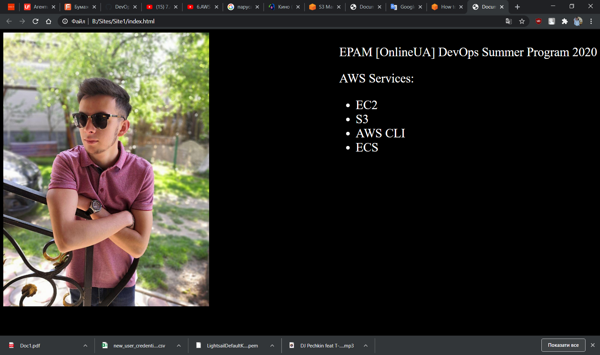

# __TASK 2.3__

##### 1. Read the terms of Using the AWS Free Tier https://docs.aws.amazon.com/en_us/awsaccountbilling/latest/aboutv2/billing-free-tier.htmland the ability to control their own costs.

  __* compleated__

---

##### 2. Review the 10-minute exampleLaunch a Linux Virtual Machine. https://aws.amazon.com/getting-started/tutorials/launch-a-virtual-machine/?trk=gs_card. Repeat, create your own VM in the AWS cloud and connect to it. It is recommended to use the t2.micro instance and the CentOS operating system.

  * choosing and instance type

  

  * configuring security group

  

  * proof that my VM is working

  

  * connecting to my VM

  

---

##### 3. Review the 10-minute exampleStore and Retrieve a File  https://aws.amazon.com/getting-started/tutorials/backup-files-to-amazon-s3/?trk=gs_card. Repeat, creating your own repository.

  * creating the bucket

  

  * proof that my bucket is working

  

  * uploading the music file

  

  * proof that the file is uploated

  

  * downloading the music file

  

  * deleating the music file

  

  * deleating the bucket

  

---

##### 4. Review the 10-minute example https://aws.amazon.com/ru/getting-started/tutorials/launch-a-wordpress-website/. Repeat  the  steps,  create  your  own site.

  * proof that my VM with wordpress is created

  

  * login to my site

  

  * creating the static IP

  

  * proof that wordpress is working

  

---

##### 5. Review   the   10-minute example https://aws.amazon.com/getting-started/hands-on/get-a-domain/?nc1=h_ls. Explore  the  possibilities  of  creating  your  own  domain and domain name for your site.

  * compleated

---

##### 6. Review  the  10-minute example https://aws.amazon.com/getting-started/hands-on/backup-to-s3-cli/?nc1=h_lsCreate  a  user  AWS  IAM,  configure  CLI  AWS  and upload any files to S3.

  * Creating the AWS IAM User

  

  * Installing the AWS CLI

  

  * Configuring the AWS CLI, uploading and downloading the file

  

  * Deleating the file

  

---

##### 7. Create  a  static site  in  S3,  publicly  available.  Post on  the page your  own  photo,  the name of the educational program and a list of AWS services with which the student worked within the educational program or earlier.

  * code of my site

  

  * Uploating it to S3

  

  * my site: https://olegmar1-bucket.s3.eu-central-1.amazonaws.com/index.html

  
