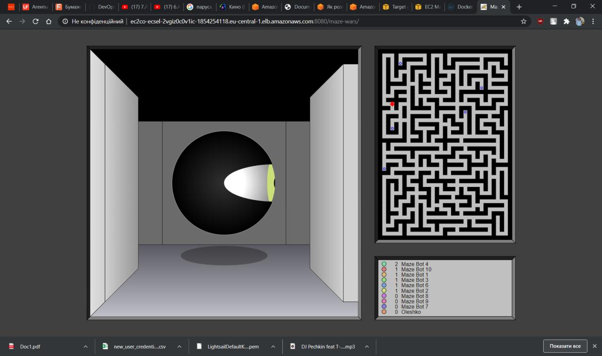

# __TASK 2.4__

### 1. Review  the 10-minute  example Deploy  Docker  Containerson  Amazon  Elastic Container  Service  (Amazon  ECS) https://aws.amazon.com/getting-started/hands-on/deploy-docker-containers/?nc1=h_ls.Repeat, create a cluster, and run the online demo application.

  * Creating the cluster

  

  * Proof that cluster is working

  

  * Load Balancer

  

  * Launching AWS ECX Sample App

  

  * Deleating the cluster

  

---

### 2. (option)To change custom settings and run otherapplication.

  * I have docker image 'maze-wars' on dockerhub from my another project and I tried to launch it. It is funny game

  

  * Creating the cluster

  

  * Proof that cluster is working

  

  * Load Balancer

  

  * Launching Tomcat with 8080 port

  

  * List of applications, select maze-wars

  

  * Now you can see some screenshots from this funny game

  

  

  

  

  

  * Deleating the cluster

  
