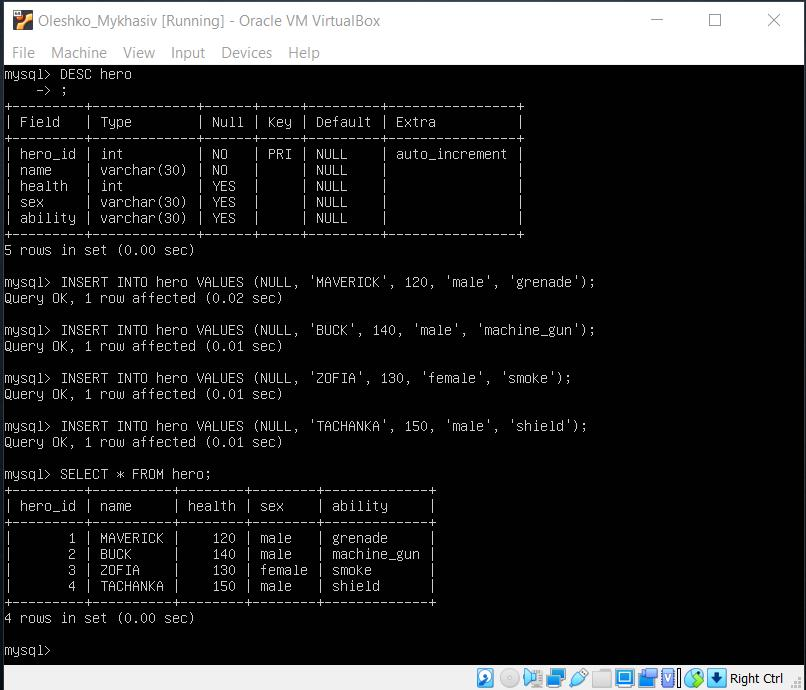

# 
 __TASK 3.1__ 

---

1. Download MySQL server for your OS on VM.
2. Install MySQL server on VM.

  

  

---

3. Describe the database schema, (minimum 3 tables)

  

---

4. Create a database on the server through the console.

  * create a table with guns and a table with heroes.

  

  * run `DESC gun` and `DESC hero`

  

  * create table with players and run `DESC player`

  

---

5. Fill in tables.

  * fill table with heroes

  

  * fill table with guns

  

  * fill table with players

  

  * some information about players

  

---

6. Execute SQL queries DDL, DML, DCL,

  * DDL (CREATE, ALTER, DROP...) you can see at the previous and next images.

  * DML (SELECT, INSERT, UPDATE, DELETE...) you can see at the previous images.

  * DCL (GRANT, REVOKE) you can see at the next images.

---

7. Create database users with different rights.

  * create user `oleh1` with `CREATE` and `SELECT` permissions and user `oleh2` with `DROP` permissions.

  

  * try to do something from `oleh1`

  

  * try to do something from `oleh2`

  

---

8. Make a selection from the main table DBMySQL.

  * `SELECT user,authentication_string,plugin,host FROM mysql.user;` (I chose the most important variables)

  
