# 
 __TASK 3.2__ 

---

1. Make backup of your database.

  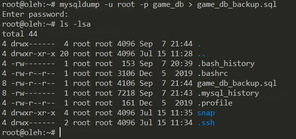

---

2. Delete the table and / or part of the data in the table.

  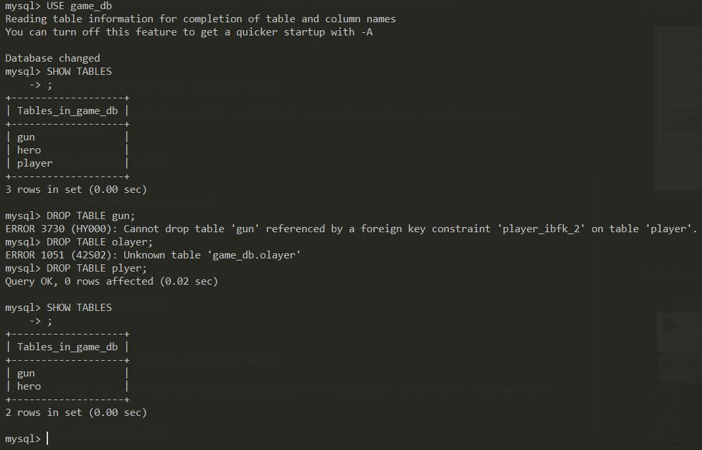

---

3. Restore your database.

  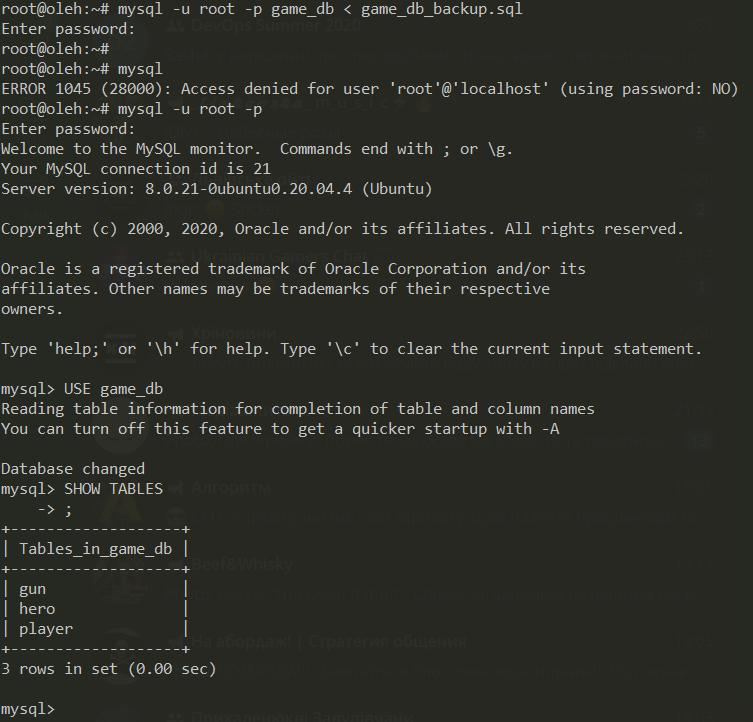

---

4. Transfer your local database to RDS AWS.

  * so, i tried to connect to RDS database, but I couldn't do it because my default VPS forbade me to do so. And i needed to create a new VPC group.

  * create new VPC

  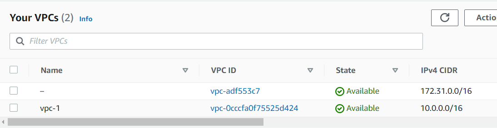

  * create two subnets for my new VPC

  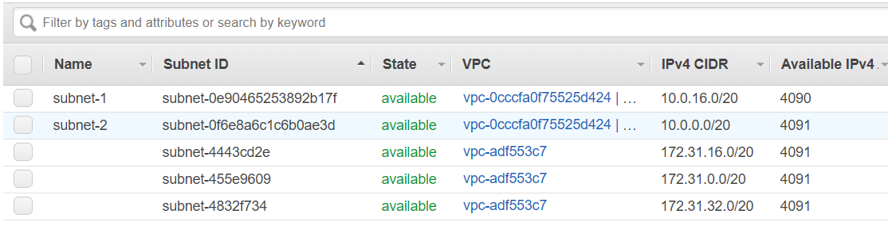

  * create new Internal fateway

  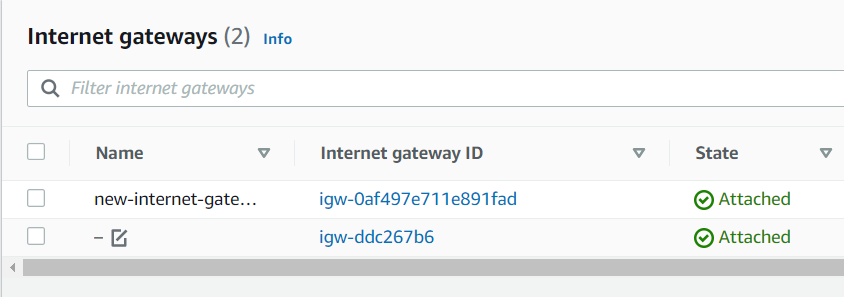

  * create new route table and add one rule.

  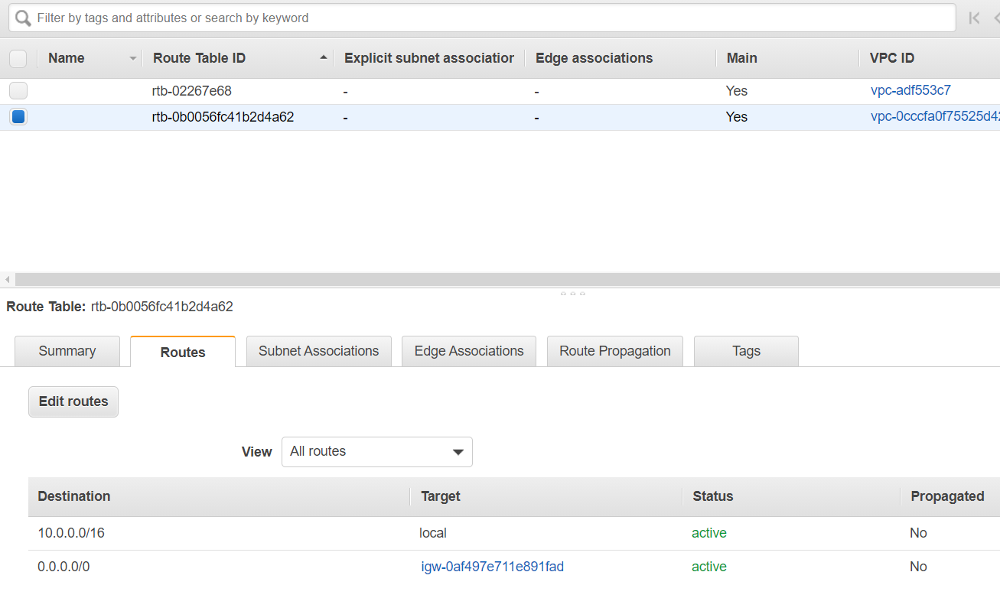

  * add two rules for default security group

  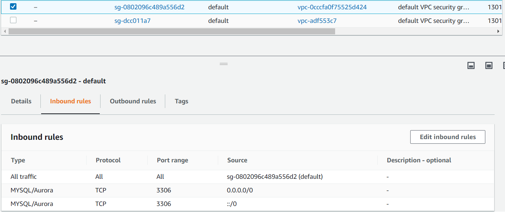

  * turn on `Public accessibility` in the finished database

  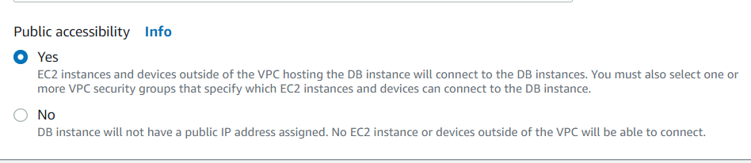

  * also, when I was creating my instance, i added an empty DB with the same name as the DB in the backup file.

  * copy endpoint

  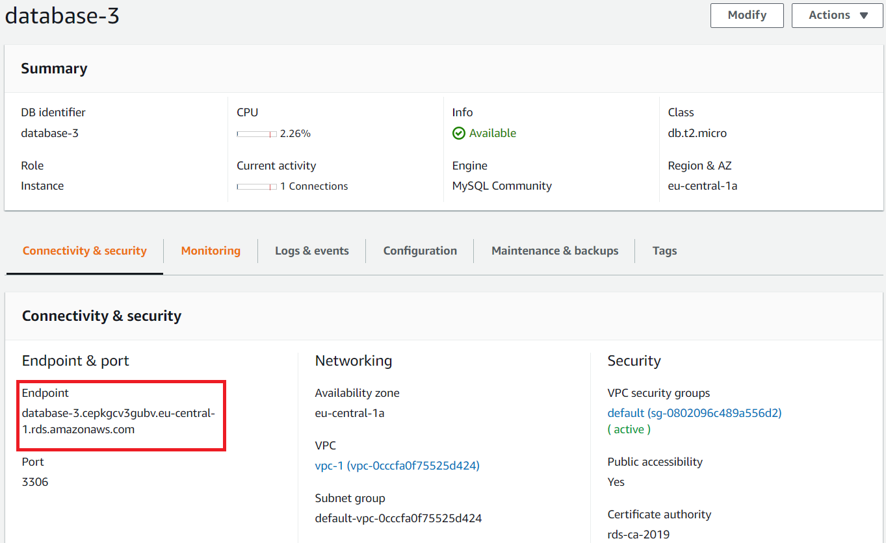

  * run `mysql -h database-3.cepkgcv3gubv.eu-central-1.rds.amazonaws.com -u admin -p -P 3306 < gamedb.sql` and as you can see, I did it successfully! My DB is in RDS.

  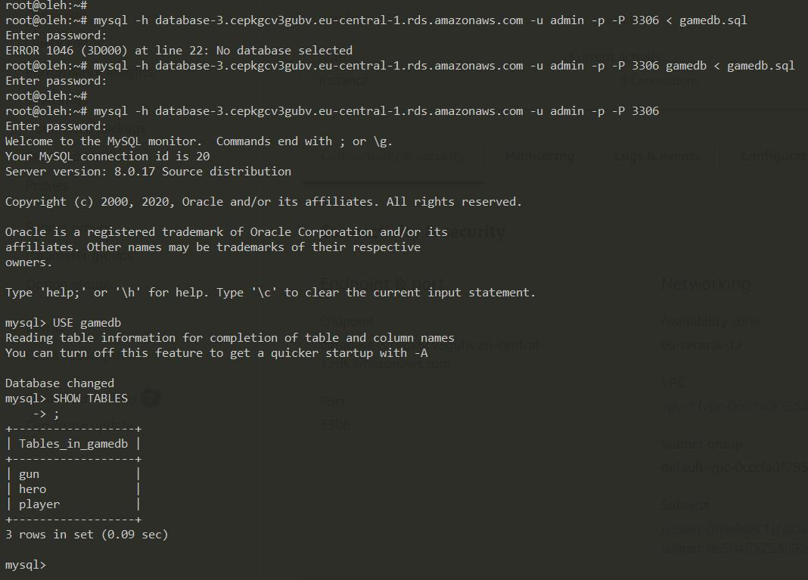 
