# 
__TASK 4.1__

---

1. Зібрати наступний проек, який містит в собі: 4 ПК типу PC-PT, Концентратор(Hub-PT). Кожен  комп'ютер  повинен  бути  з'єднаний  з концентратором за допомогою крученої пари(CopperStraight-through).

2. Зберегти проект і його скріншот.

  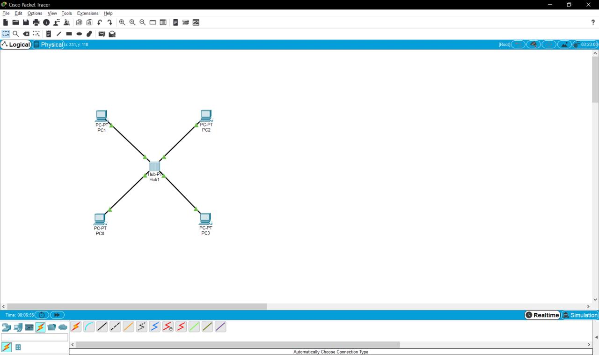

  <a href="files/1.pkt" download>Click to Download</a>

3. Кожному  ПК  привласнити  унікальну IP  адресу.  Для її призначення необхідно  зайти  в меню  конфігурації ПК  шляхом  одноразового клацання  по ньому  лівою  кнопкою  миші  і  вибору  вкладки  Config  /  Interface.  В  поліip address необхідно ввести відповідну адресу, а вполі Subnet Mask -відповідно цьому адресу маску.

4. Перевірити  працездатність  отриманої  мережі  шляхом  здійснення Інтернет  запитів  (ICMP  пакетів)  від  одного  ПК  до  іншого.  Для  присвоєння такого пакета ПК використовуйте кнопку ADD SIMPLE PDU в правій частині робочого  вікна.  Після  цього  клацніть  лівою  кнопкою  миші  на  локальну машину-джерело, потім -на машину-одержувача. Перевірити працездатність мережі.

5. Перейти  в  режим Simulationі  за  допомогою  кнопкиEventListвикликати вікно відображення подій в мережі SimulationPanel. Використовуючи  кнопку  Auto  Capture  /  Play  запустити  симуляцію роботи  ICMP  пакетів.  Простежити  просування  пакетів  по  мережі  і  зберегти даний скріншот.

  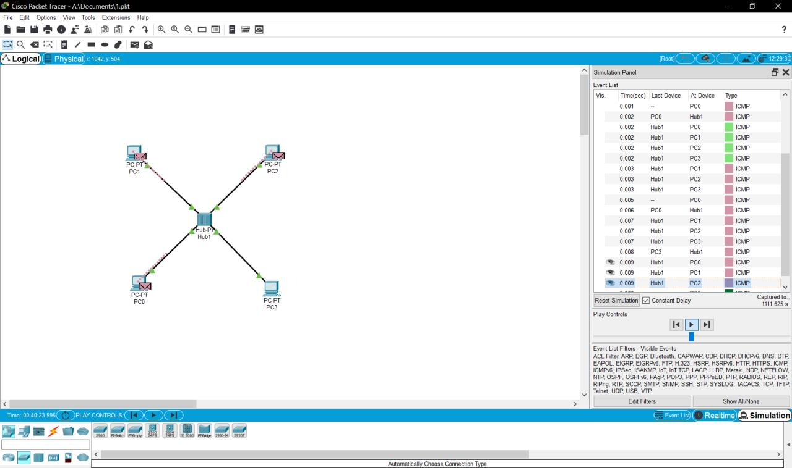

6. Простежити  за  порядком  і  шляхом  проходження  пакетів  у  вікні Simulation Panel. Зберегти даний скріншот.

7. Переглянути  інформацію опакетах  з  вікна SimulationPanelі  їх відповідність моделі OSI шляхом подвійного клацання по пакету в вікні. Результати зберегти як скриншот.

  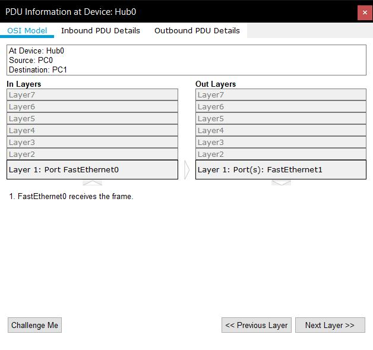

8. Видалити  IP  адреса  з  кожною  локальною  машини  PC0 -PC3. Повторити пункти 5 -10. Проаналізувати відмінності в роботі мережі.

  * _Нічого нікому не відправить, бо немає IP якому надсилати_

---

9. Зібрати наступний проект. У нього входять: PC0-PC5, Server, 2  Hubs.  Однойменні  пристрої  з'єднуються  за  допомогою  кросового  кабелю (Copper Cross-over).

  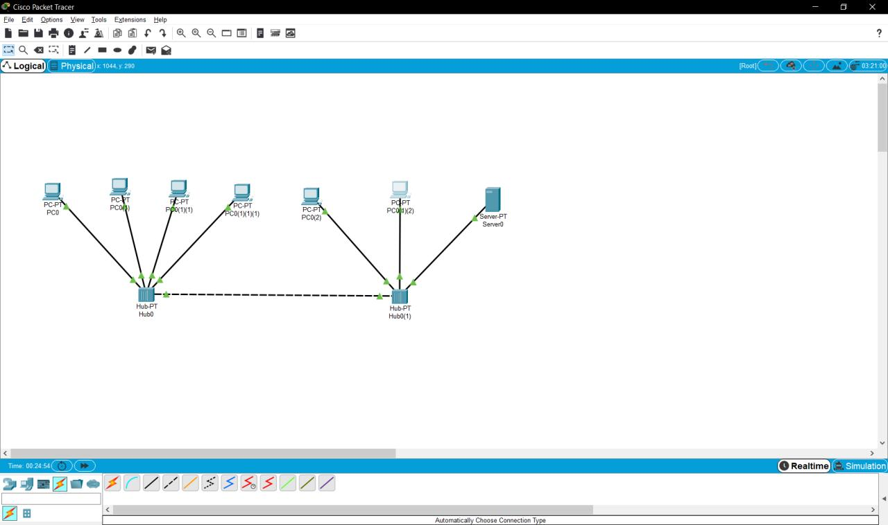

10. Кожному мережному компоненту привласнити IP адрес.

11. Перевірити працездатність мережі.

  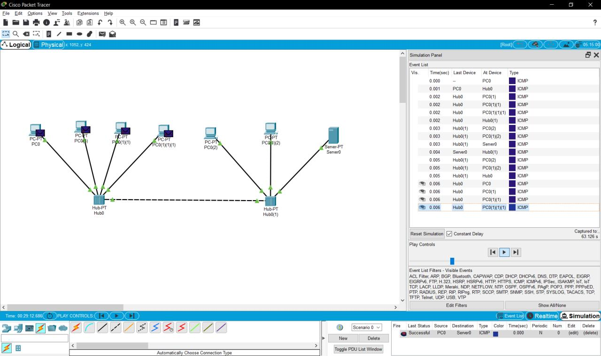

---

12. Створити  новий  проект,  який  включає  в  себе:  4  ПК  типу  PC-PT, Комутатор    (Switch).    Кожен    комп'ютер    повинен    бути    з'єднаний    з концентратором  за допомогою  крученоїпари  (Copper  Straight-through).

  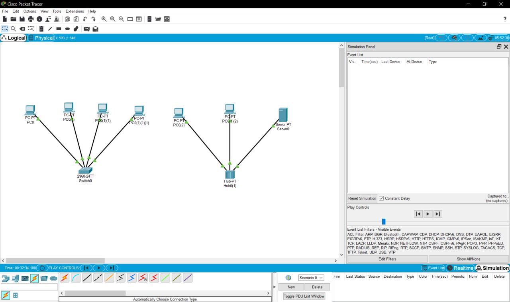

13. Для   даної   топології   повторити   пункти   3-9.   Проаналізувати відмінності в роботі мережі Топології 1 і Топології 3.

  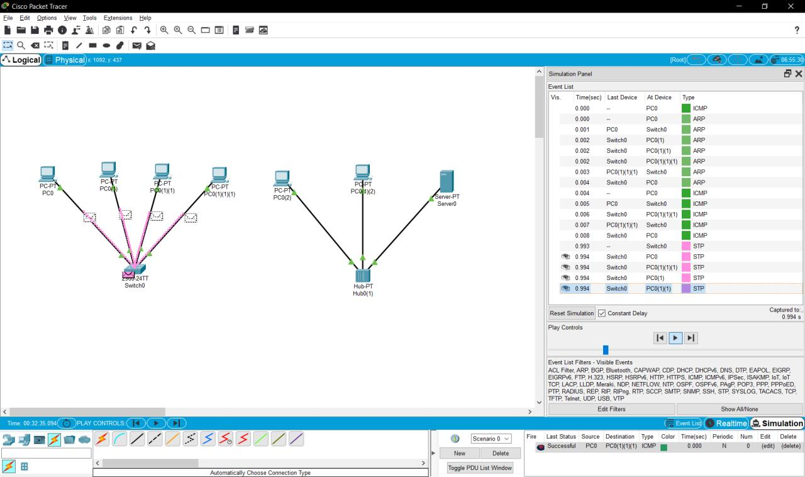

  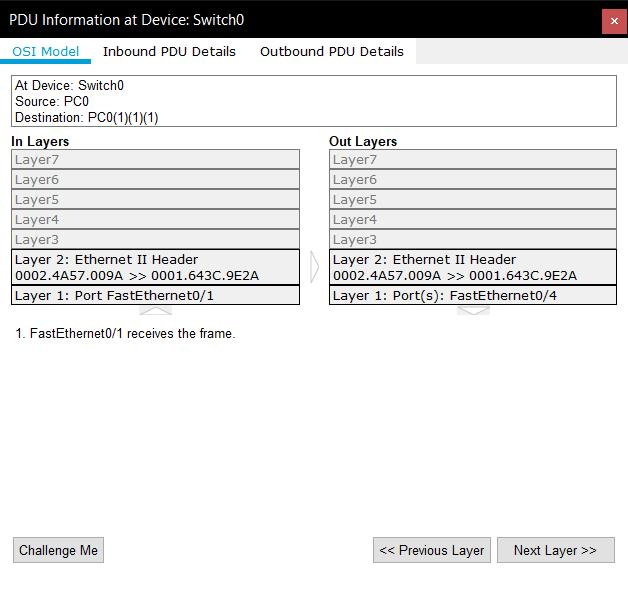

  * _мережа з комутатором працює на 2 рівні OSI, а мережа з концентратром на 1 рівні OSI. Мережа з комутатором є надійнішою, тому що дані відсилаються тільки певному отримувачу завдяки табличі MAC адресів в комутаторі._

---

14. Розширити проект до такого вигляду (рис. 7). У нього входять: 8 ПК типу PC-PT, 2 комутатори (Switch). Кожен комп'ютер повинен бути з'єднаний з   комутатором   за   допомогою   крученоїпари   (Copper Straight-through), комутатори  між  собою з'єднуються  за допомогою кросового кабелю (Copper Cross-over).

  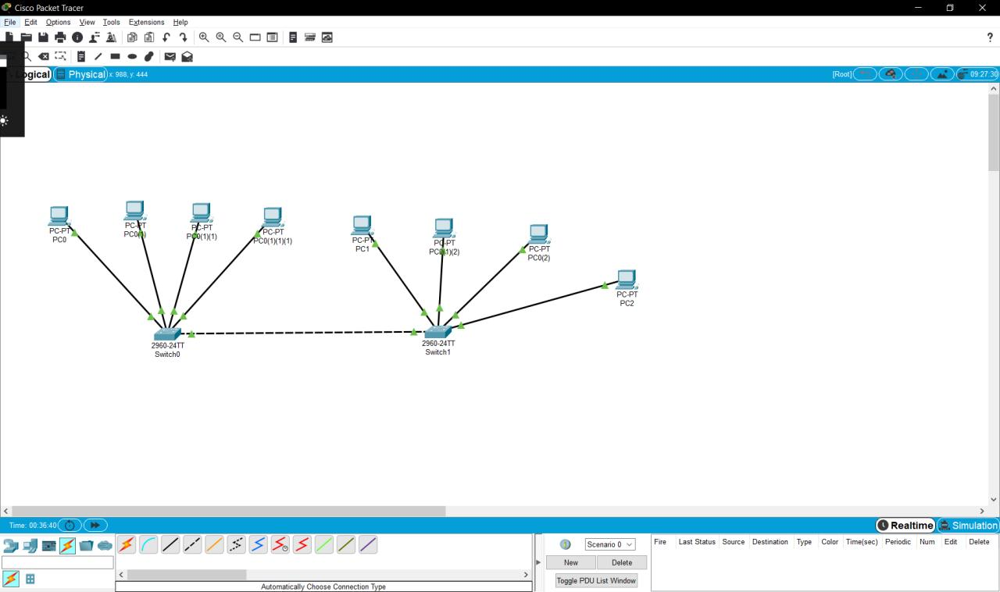

15. За необхідністюдодати  додаткові  порти  на  комутатори.  Для  цього необхідно  у  вкладці  Physical  /  MODULES  кожного  з  них  перетягнути доступний порт Ethernet в порожнє гніздо, попередньо вимкнувши комутатор за допомогою кнопки вимкнення.

16. Кожному мережному компоненту привласнити IP адрес.

17. Перевірити працездатність мережі.

  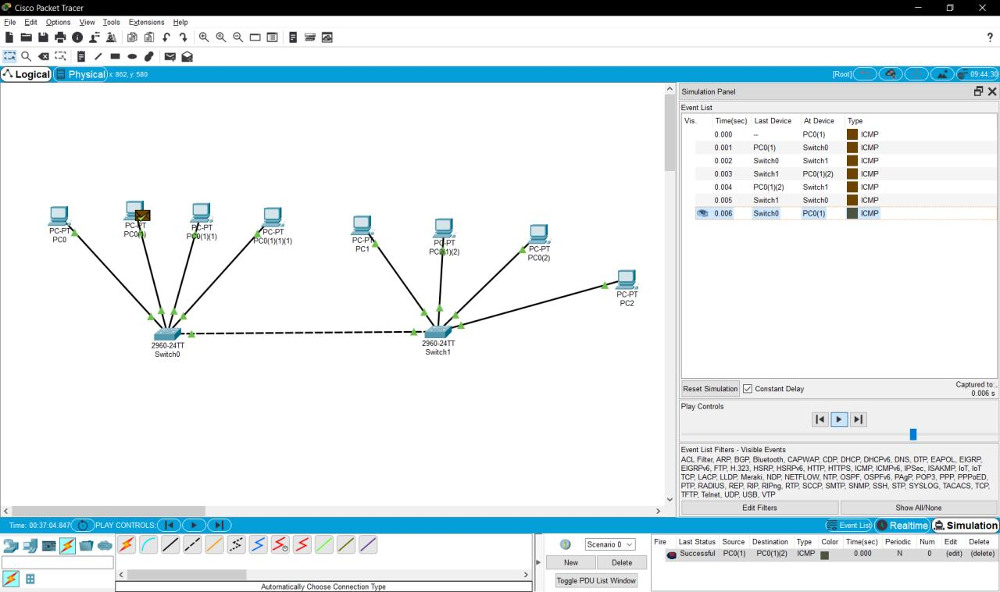

---

18. Існуючу  мережу  розбити  на  дві  рівні  підмережі.  І  з'єднати  їх  за допомогою   маршрутизатора   Router-PT   з   декількома   портами   (рис.   8). Маршрутизатор і комутатори з'єднати між собою за допомогою оптоволокна (Fiber).

  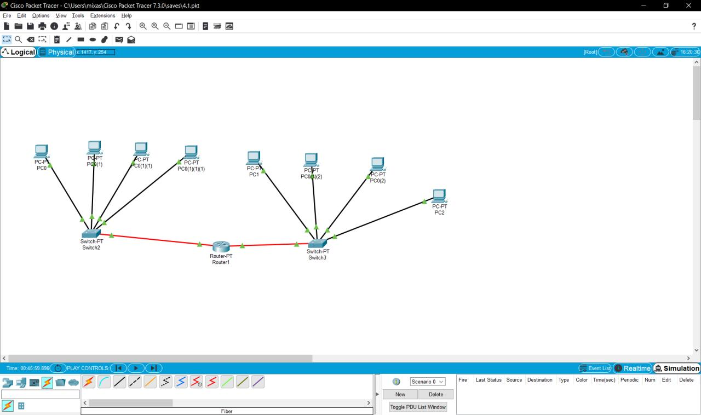

19. Комп'ютерам РС4–РС7 привласнити  IP  адреси.

20. Порти  маршрутизатора  слід  включити  (On)  і  призначити  їм  IP адреси в діапазоні обраної підмережі.

21. На кожному з комп'ютерів (РС0 -РС7)необхідно позначити шлюз. Для  його призначення  необхідно  зайти в  меню  Desktop  /  Ip  Configuration і  в полі  Default  Gateway  ввести  адресу  порту  маршрутизатора,  через  який  до нього підключається підмережа, що включає даний ПК.

22. Перевірити працездатність мережі.

  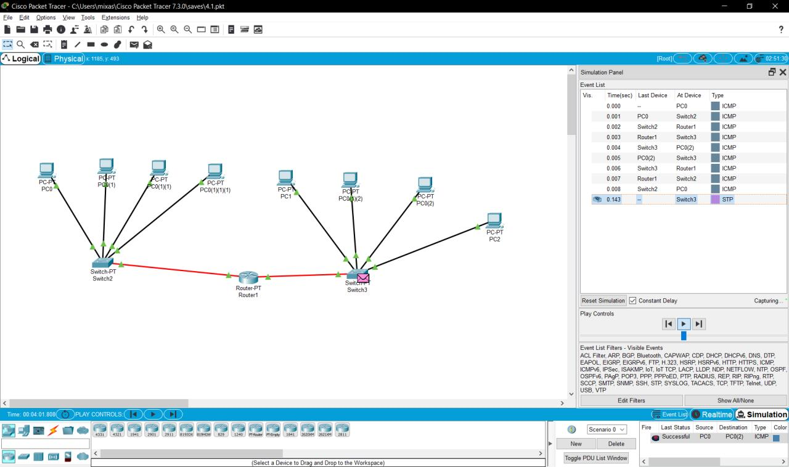

  <a href="files/4.1_v2.pkt" download>Click to Download</a>

23. Проаналізувати відмінності в роботі мережі Топології 4 і Топології 5. Оцінити можливості, які дає використання маршрутизатора

  * _маршрутизатор дає можливість з'єднати дві мережі_
