# 
__TASK 4.2__

---

1. Необхідно змоделювати корпоративну мережу організації, яка містить 2  будинки  по  2  поверхи  в  кожному.  Горизонтальна  підсистема  поверху складається з однієї робочої групи по 5 комп'ютерів

  <a href="files/4.2.1.pkt" download>Click to Download</a>

  * мережа виглядає так:

  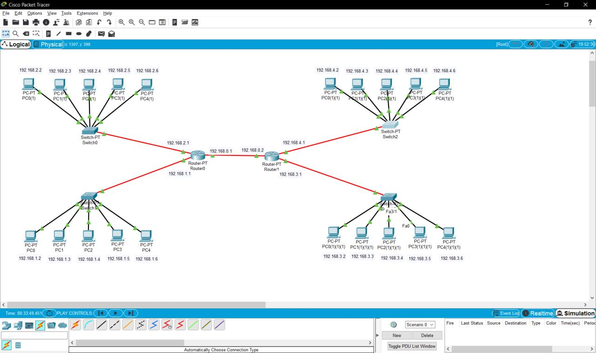

  * роутер №1 настроєний так:

  

  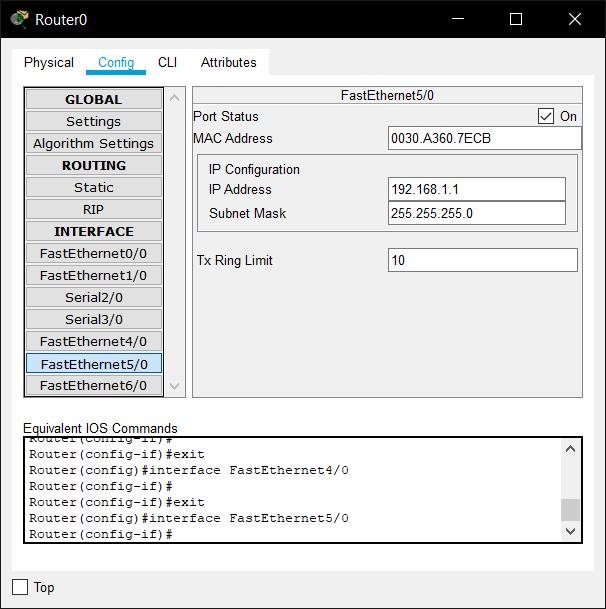

  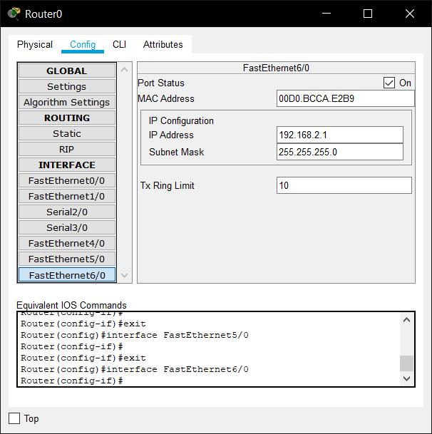

  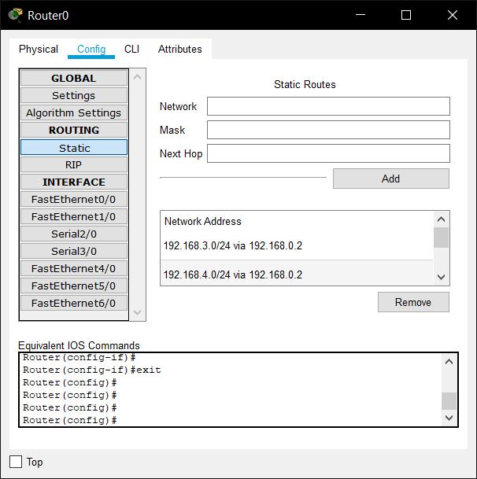

  * роутер №2 настроєний так:

  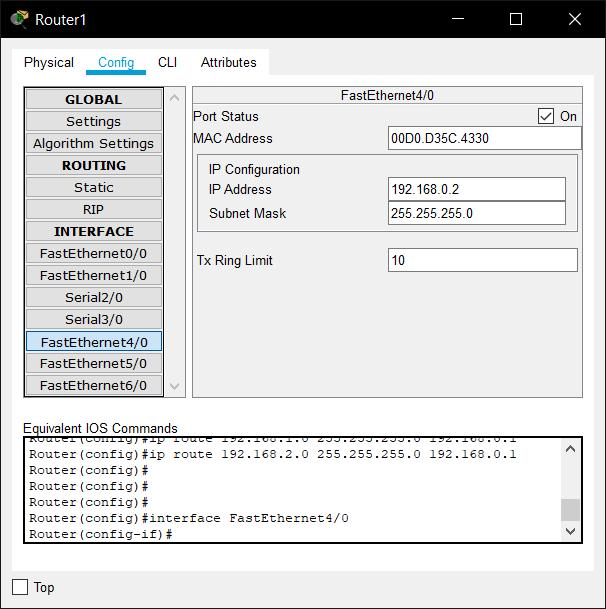

  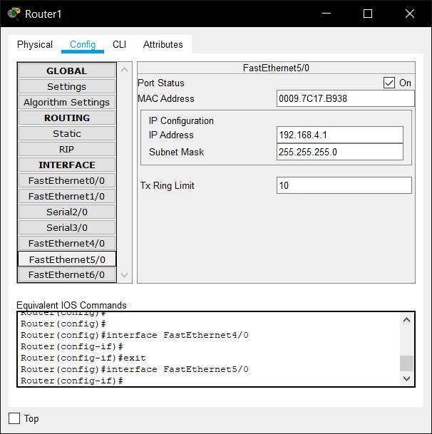

  

  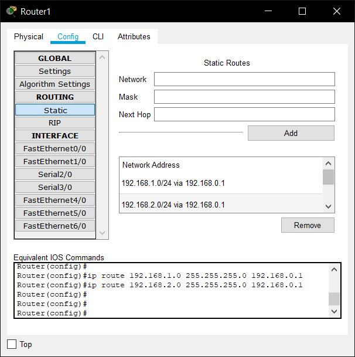

  * тестування працездатності:

  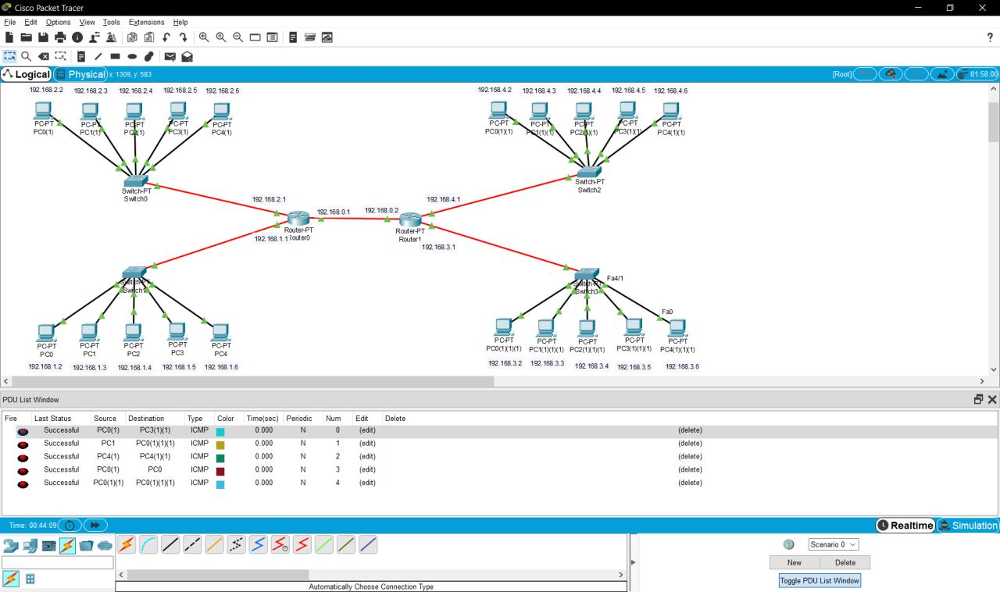

  * Routing tables:

  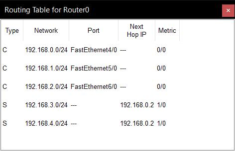

  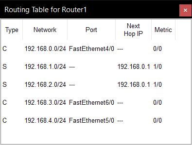

  * Кінцевий результат:

  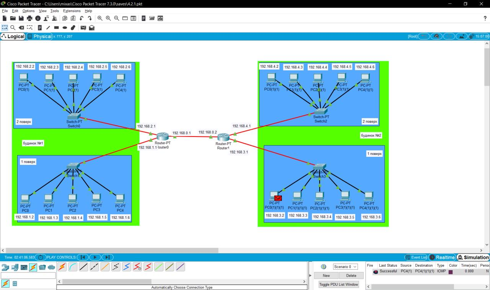

---

### Далі я не хотів робити багато скріншотів, тож вирішив записати відео :) Приємного перегляду!

---

2. Необхідно змоделювати корпоративну мережу організації, яка містить 1  будинок  з  чотирма  поверхами.  Горизонтальна  підсистема  поверху складається з двох робочих груп по 3 і 5 комп'ютерів відповідно.Провести логічну структуризацію мережі на 8 підмереж (відповідно до  кількості  робочих  груп).  Провести  аналіз  працездатності  мережі  і  її трафіку.

<a href="files/4.2.2.pkt" download>Click to Download</a>

#### __YouTube video (click to play):__

---

3. Необхідно  змоделювати  локальну  мережу  комплексу  з  5 одноповерхових будівель. Одна будівля -1 робоча група по 6 комп'ютерів. Мережа будується на основі маршрутизатора з одним портом.

<a href="files/4.2.3.pkt" download>Click to Download</a>

#### __YouTube video (click to play):__

