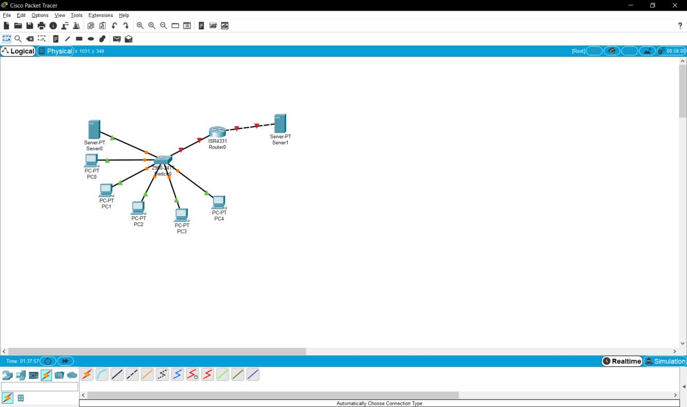

# 
__TASK 4.3__

---

1. Розставляємо  на  робочому  полі  необхідні  вузли,  використовуючи браузер в нижній частині вікна. З'єднуємо вузли відповідно до завдання за допомогою крученої пари.

2. Задамо  ip-адреси  вузлів  сегмента  в  діапазоні  192.168.0.х,  а  сервера, підключеного   до   маршрутизатора -192.168.1.1.   Маска   підмережі -255.255.255.0

3. Задамо  відповідні  ip  адреси  на  інтерфейсах  маршрутизатора  і включимо ці порти.

4. айдемо  в  Command  Line  Interface  маршрутизатора  і  за  допомогою команди enable secret задамо пароль для  доступу і збережемо конфігурацію.

5. ля  налаштуваннямаршрутизації  по  протоколу  RIP  відкриємо вкладку  Config  у  вікні  властивостей  маршрутизатора  і  виберемо  пункт  RIP. Задамо там адреси всіх підмереж, яким дозволено спілкування.

6. Перевіряємо  доступність  робочих  станцій.  Для  цього  в  правій  колонці вибираємо  інструмент  Addsimple  PDU  і  вибираємо  станцію-відправник  і станцію-одержувач.  Переконуємося,  що  передача  завершена  успішно.

<a href="files/4.3.pkt" download>Click to Download</a>
