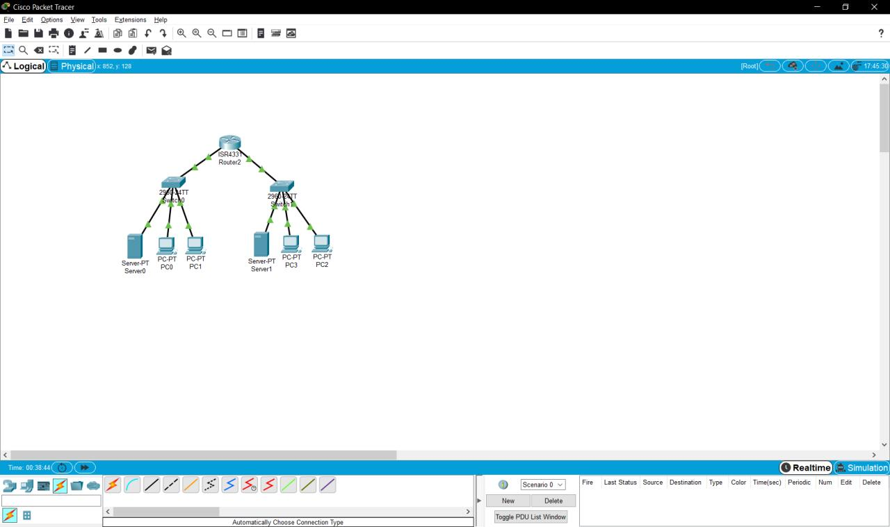
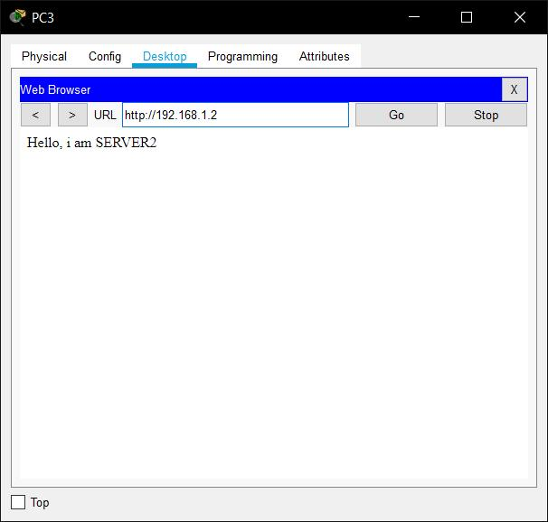

# 
__TASK 4.4__

---

1. За основу беремо будь яке завдання task4.2 або 4.3і у вашу існуючумережу додаєте роутер,такщоб їх в мережі було не менше двох. І треба налаштувати трафік між двома мережами.Якщо ж у вашій існуючій мережі вже присутньо 2 роутера і трафік налаштований, то виконання цього завдання не потрібно.

   * Вже виконав у завданні 4.2.1
   * <a href="files/4.2.1.pkt" download>Click to Download</a>

---

2. Організувати 2 підмережі. Налаштувати DNS на серверах

  * побудував мережу*

  

  * налаштування першого сервера

  

  * налаштування PC1

  

  * налаштування DNS на першому сервері

  

  * налаштування DNS на другому сервері

  

  * відкриваю сторінку першого сервера з PC0

  

  * відкриваю сторінку другого сервера з PC3

  

  * фінальний результат

  

  * <a href="files/4.4.2.pkt" download>Click to Download</a>
