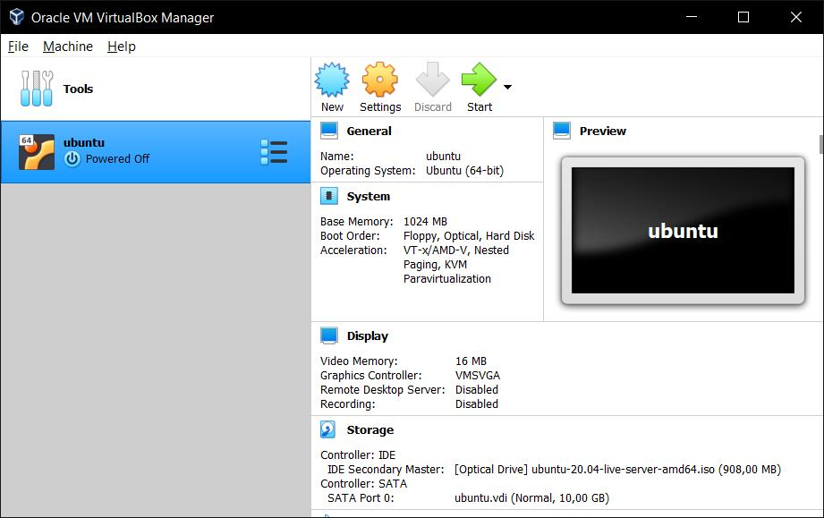
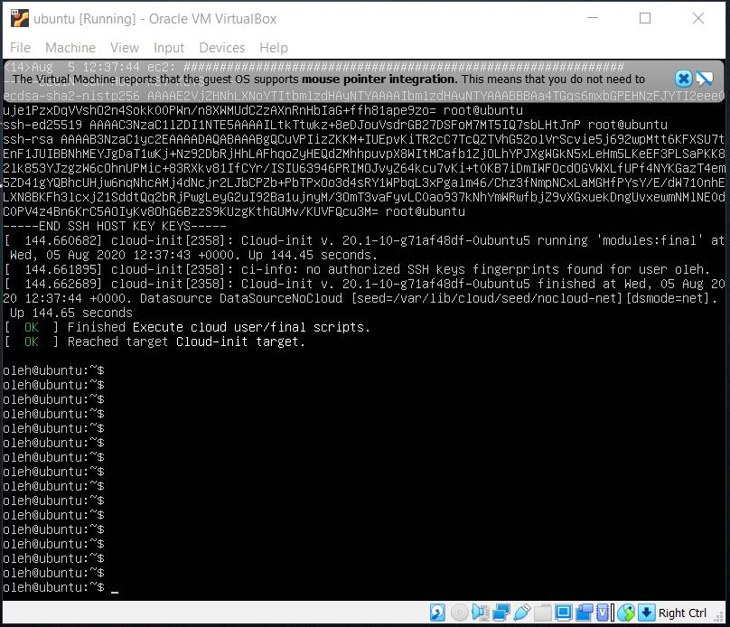
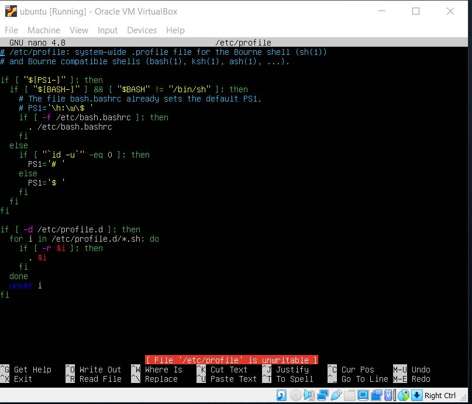
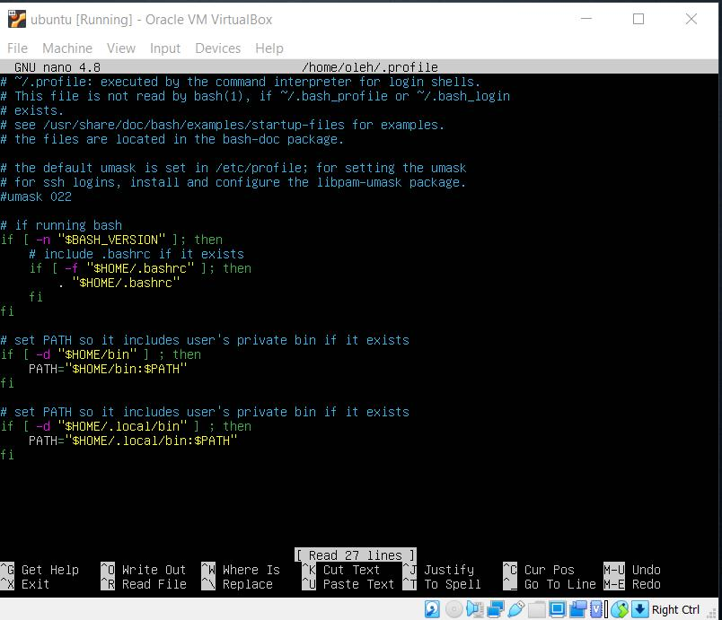
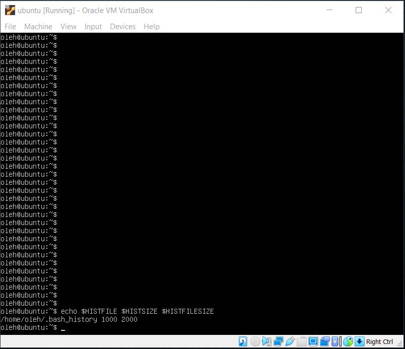
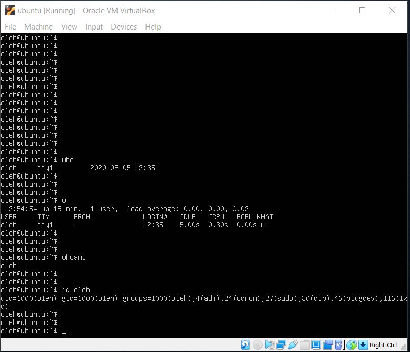
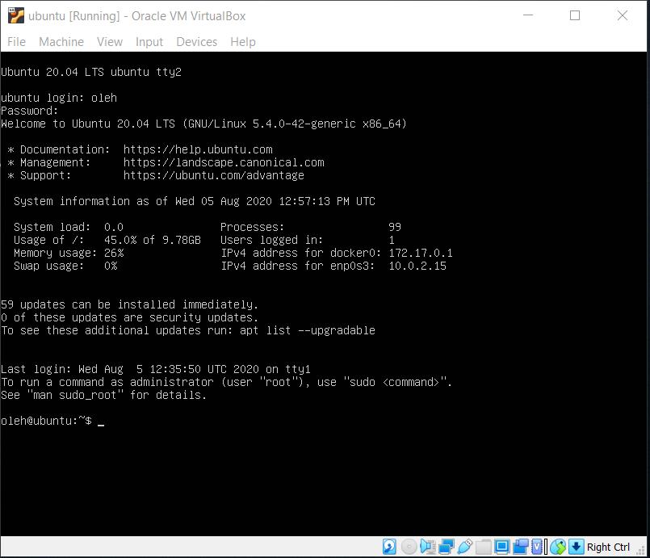
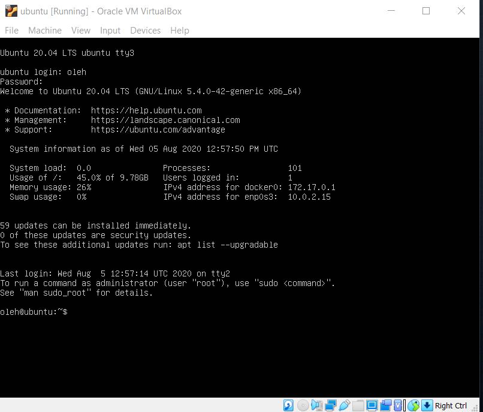
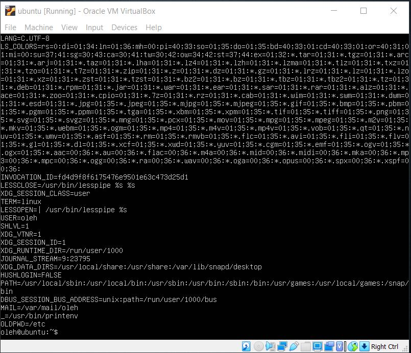

# 
__TASK 5.1__

---

1. Set up Linux Virtual Machine in VirtualBox.

---

2. Familiarize  yourself  with  the  commands  and  utilities  listed  in  the presentation  (switching  between virtual  terminals (consoles); printenv; content  of /etc/profile and ~/.bash_profile, $echo  $HISTFILE  $HISTSIZE $HISTFILESIZE, who, w, whoami, id).

  * nano /etc/profile

  

  * nano ~/.profile

  

  * $echo  $HISTFILE  $HISTSIZE $HISTFILESIZE

  

  * who, w, whoami, id oleh

  

  * switching between different consoles (tty2, tty3)

  

  

  * printenv

  
