# 
__TASK 5.2__

---

1.Invoke pwd  to  see  your  current  working  directory  (there  should  be  your  home directory).

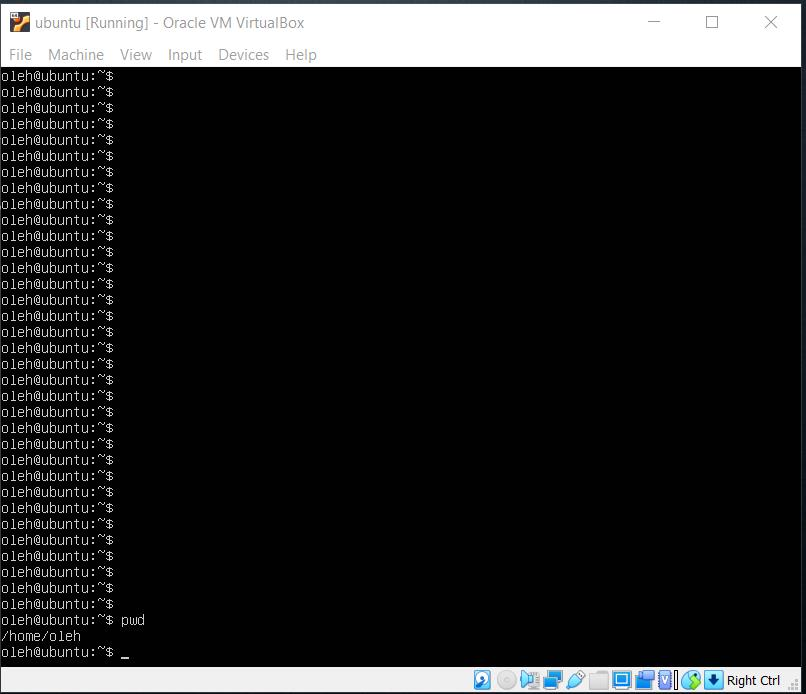

---

2. Collect output of these commands ls -l /; ls; ls ~; ls -l; ls -a; ls -la; ls -lda ~; Note differences between produced outputs. Describe (in few words) purposes of these commands.

* __ls -l /__

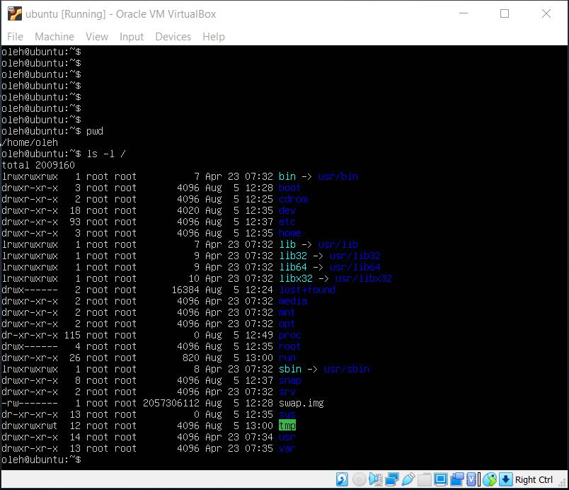

* __ls__ (ls is a Linux shell command that lists directory contents of files and directories.)

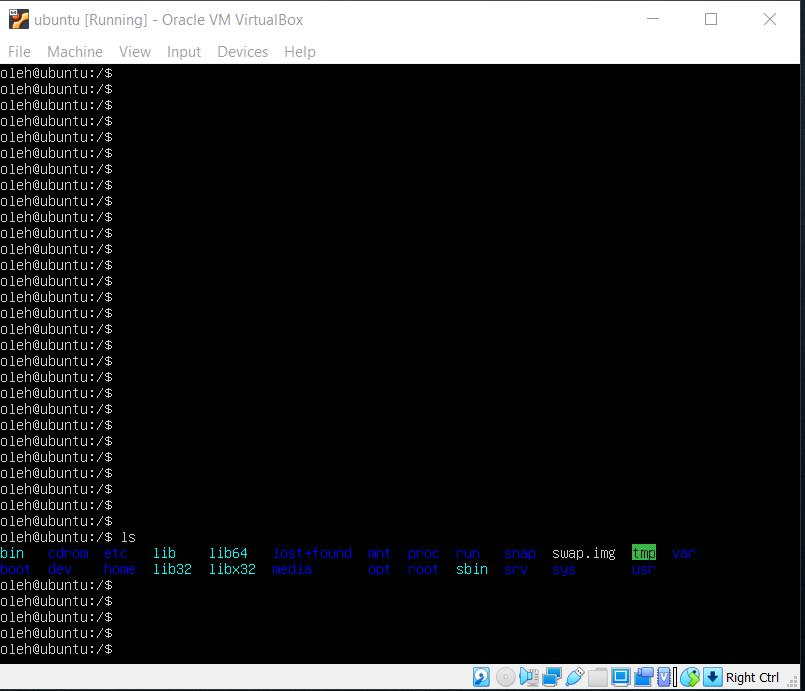

* __ls ~__ (show files whose path starts at ~)

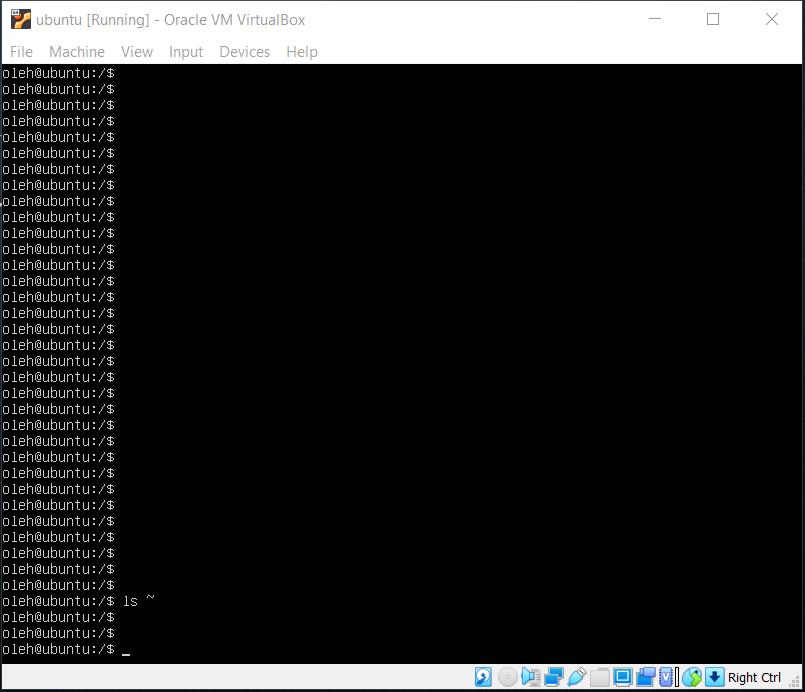

* __ls -l__ (list with long format - show permissions)

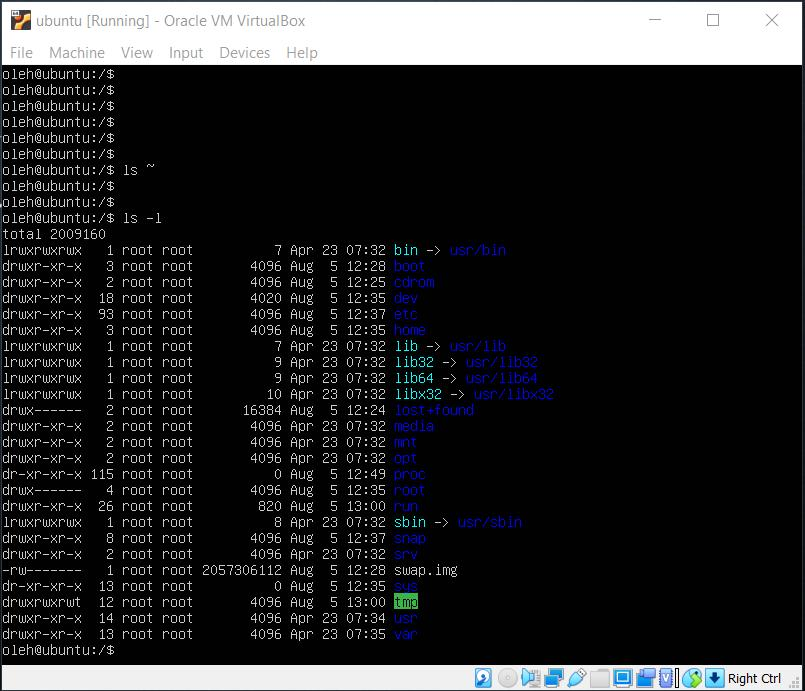

* __ls -a__ (list all files including hidden file starting with '.')

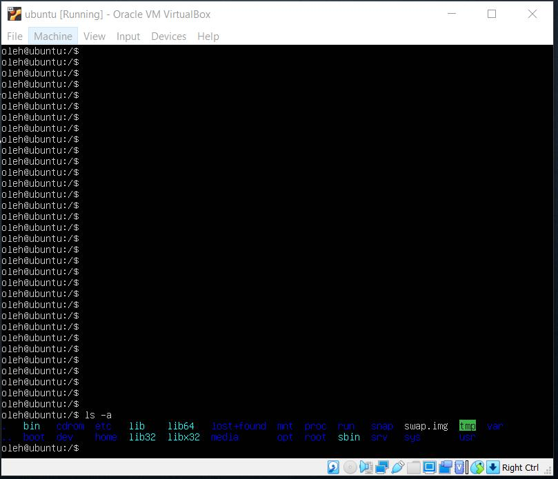

* __ls -la__ (previous two together)

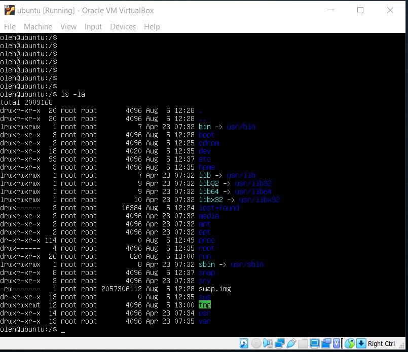

* __ls -lda ~__ ('-lda' - list directories - with ' */' with previous point)

---

3. Execute and describe the following commands (store the output, if any):

  * __mkdir test__ (create directory 'test')
  * __cd test__ (enter to this directory)
  * __pwd__ (prints the path of the working directory)
  * __touch test.txt__ (create file 'test.txt')
  * __ls -l test.txt__ (show 'test.txt' in this directory)
  * __mkdir test2__ (create directory 'test2')
  * __mv test.txt test2__ (move 'test.txt' to directory 'test2')
  * __cd test2__ (enter to directory 'test2')
  * __ls__ (show files in this directory)

  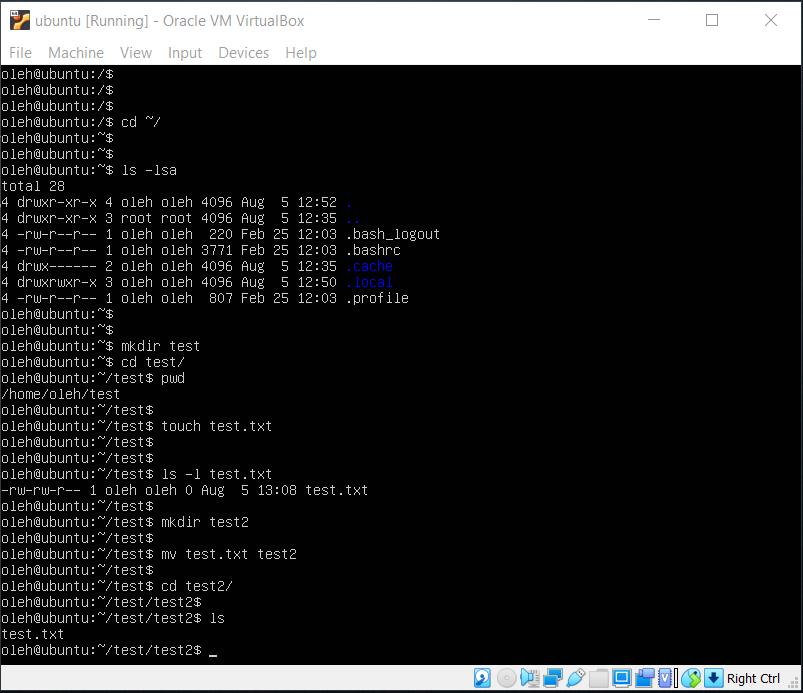

  * __mv test.txt test2.txt__ (rename 'test.txt' to 'test2.txt')
  * __ls__ (show files in this directory)
  * __cp test2.txt ..__ (copy test2.txt to the parent directory)
  * __cd ..__ (enter to the parent directory)
  * __ls__ (show files in this directory)
  * __rm test2.txt__ (remove 'test2.txt')
  * __rmdir test2__ (try to remove directory 'test2')

  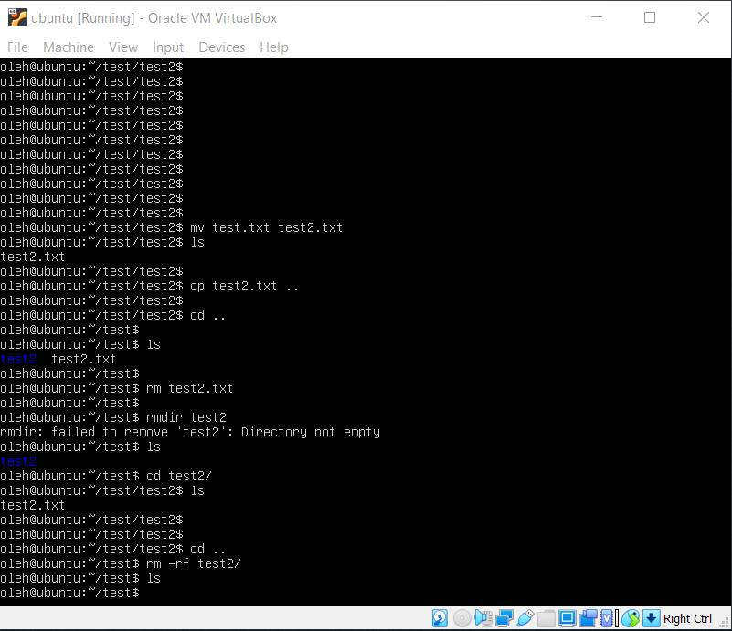

---

4. Execute and describe the difference
  * cat /etc/fstab

  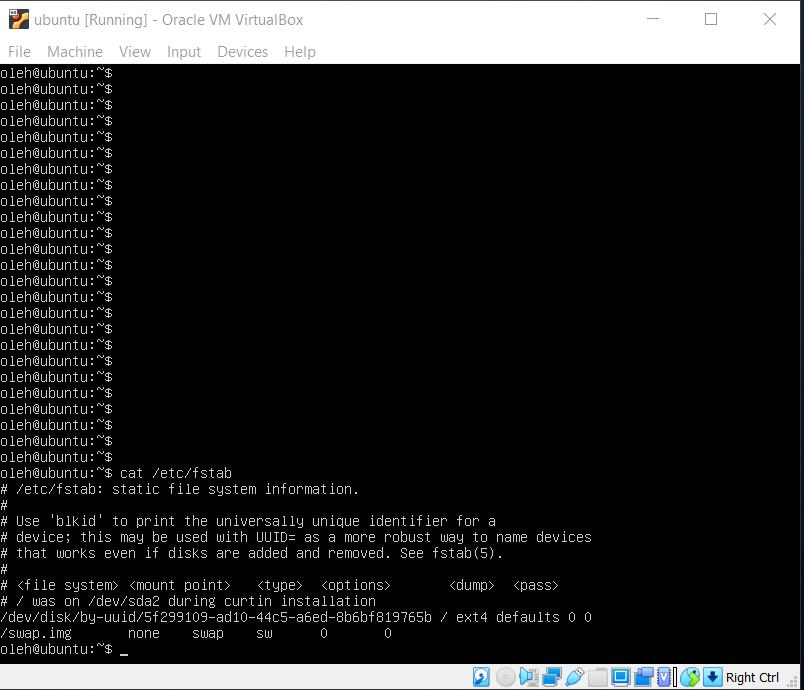

  * less /etc/fstab

  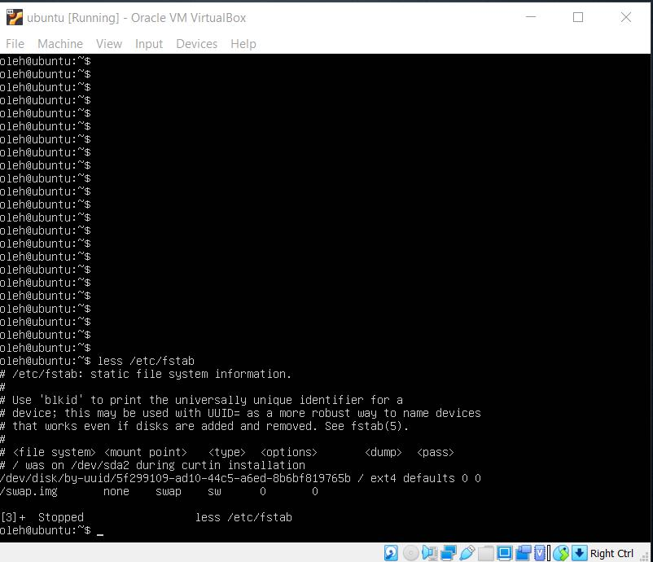

  * more /etc/fstab

  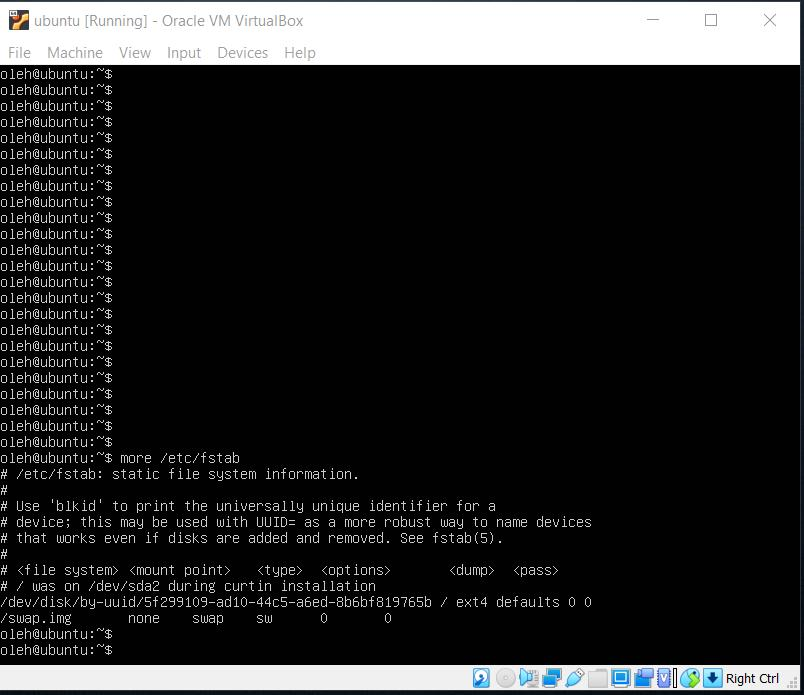

  * __more__ = to view a text file one page at a time, press spacebar to go to the next page

  * __less__ = is much the same as more command except: You can navigate the page up/down using the less command and not possible in more command.

  * __cat__ = can be used to join multiple files together and print the result on screen (it will not show page by page)

---

5. Look through man pages of the listed above commands.

* __cat__

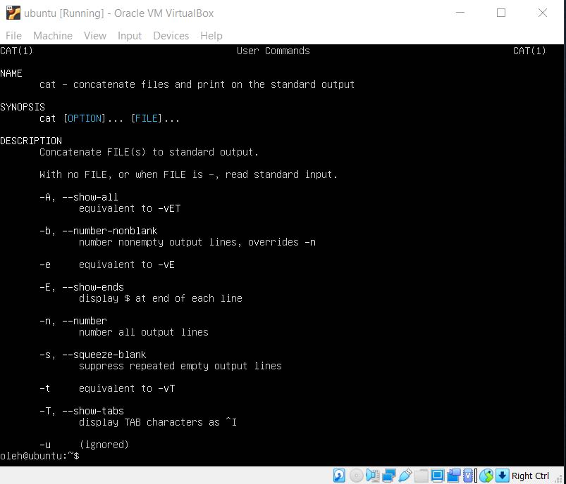

* __less__

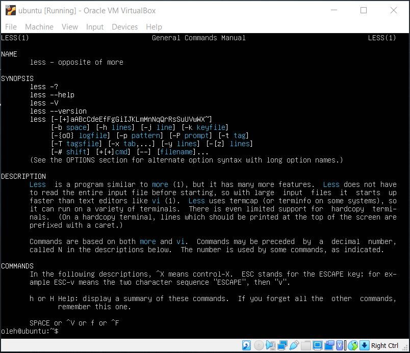

* __more__

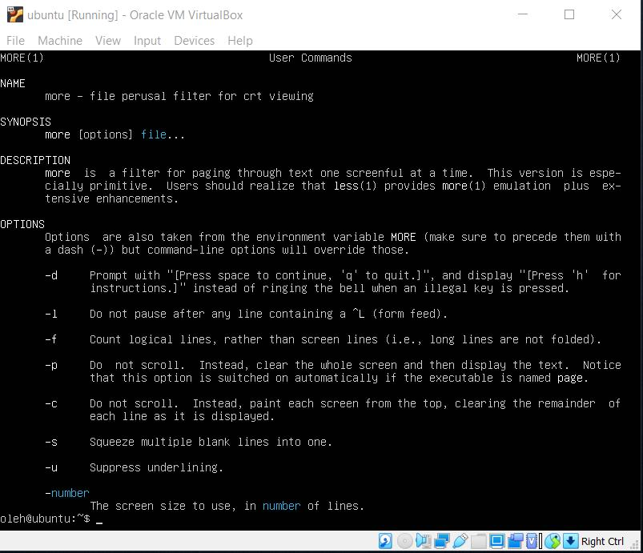
