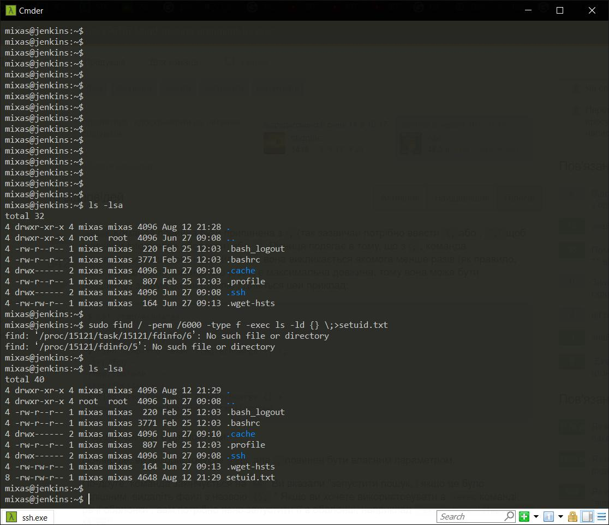
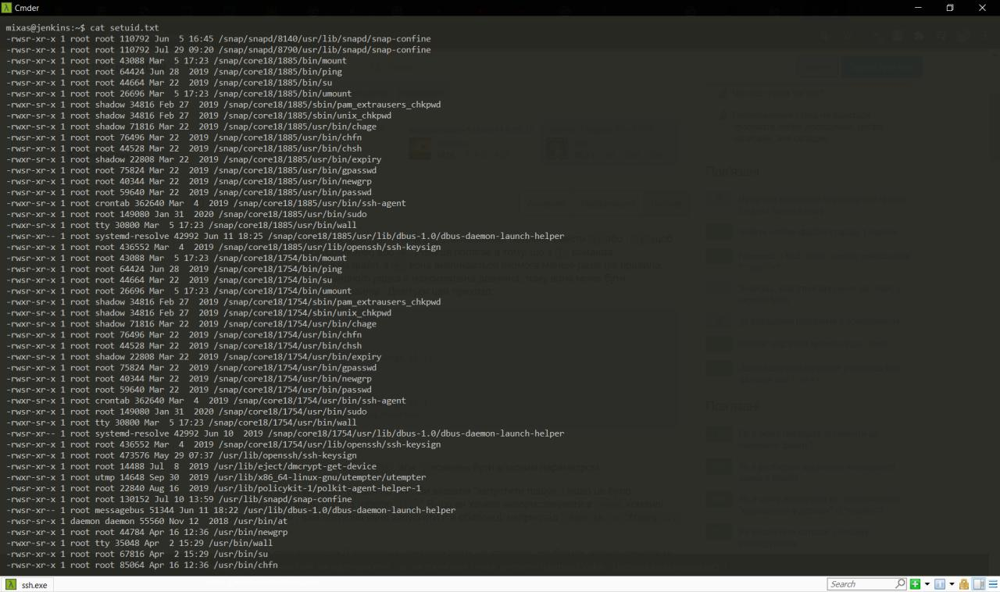
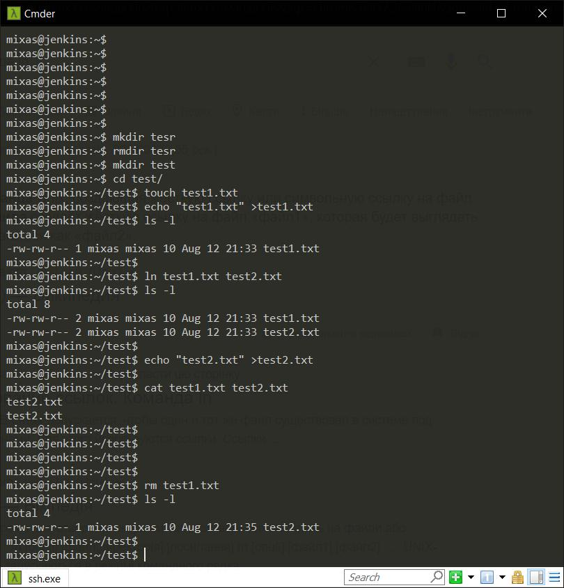
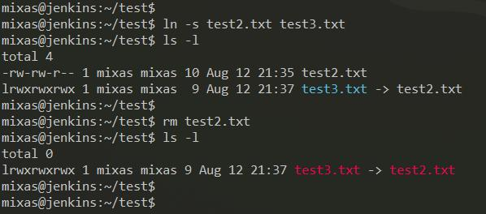
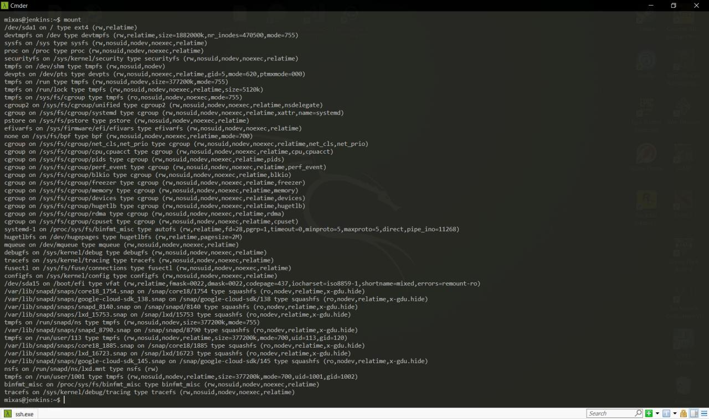
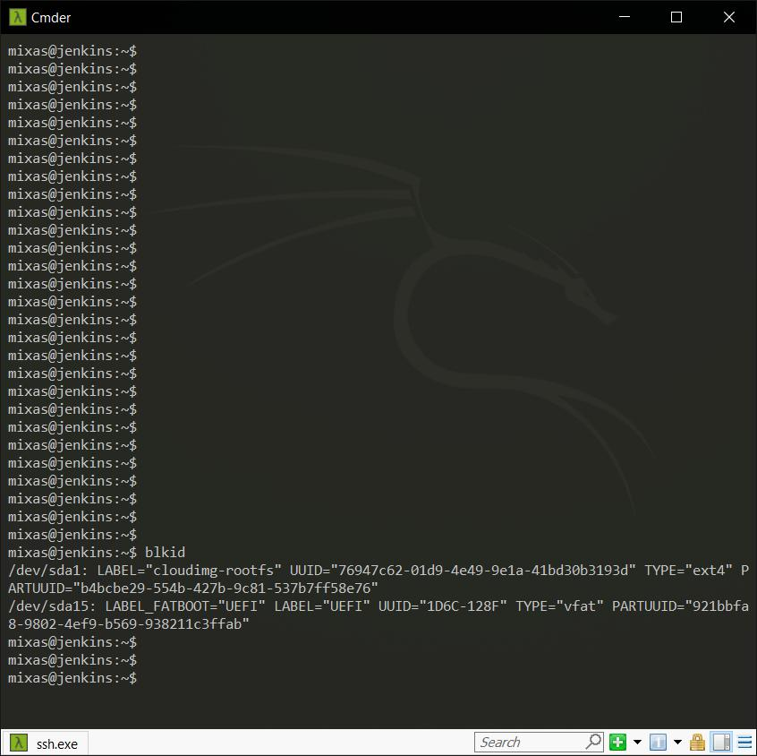
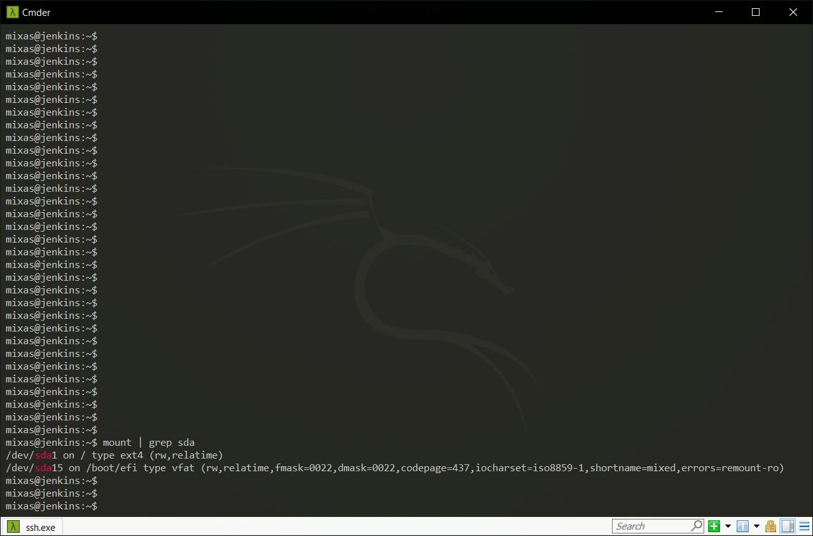
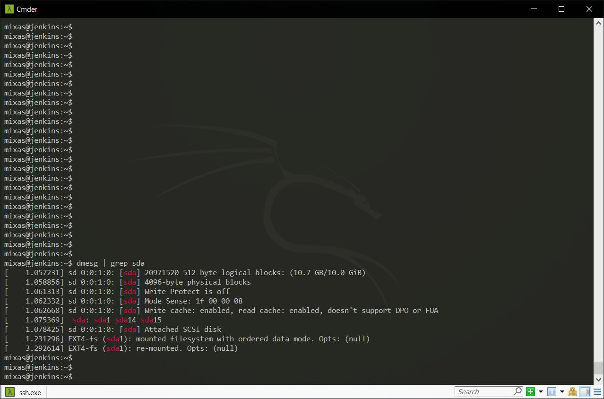
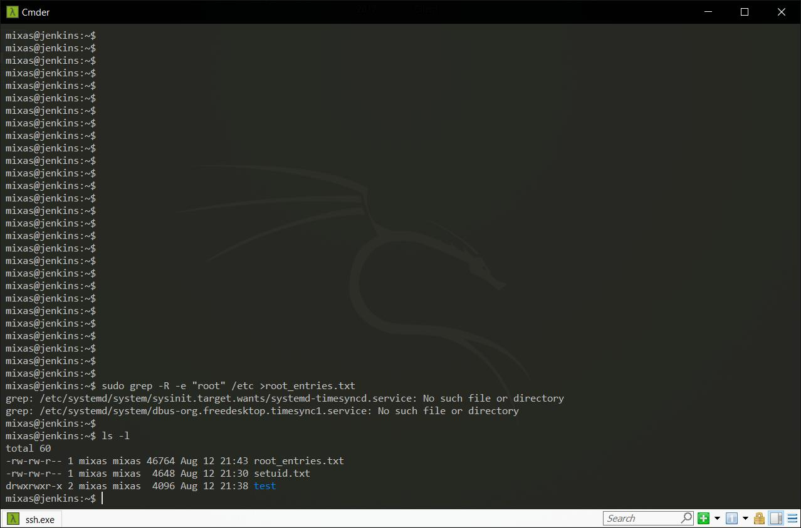
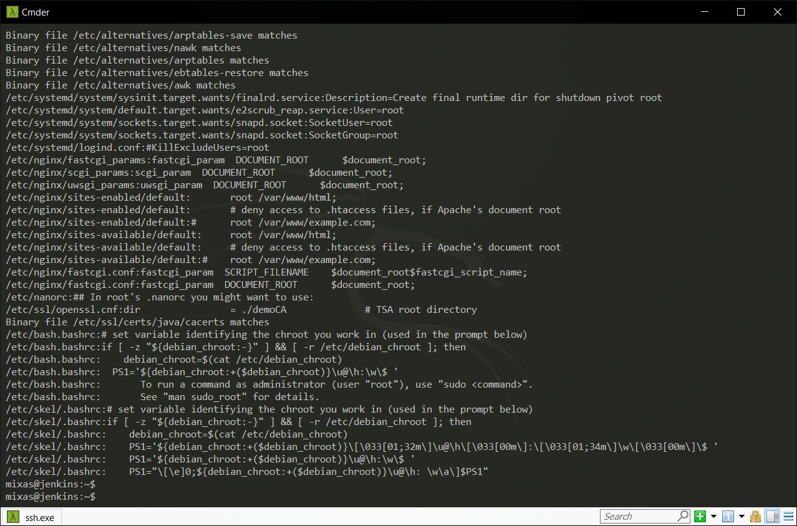

# <p align="center">**TASK 5.3**</p>

---

1. To discover files with ac=ve s=cky bits, use the following version of the find com-mand: `sudo find / -perm /6000 -type f -exec ls -ld {} \;>setuid.txt`



* Put into your report a fragment of setuid.txt file.



* Explain meaning of parameters of the above find command (hint: use find’s man page).\
  * `-perm /6000` = find files with some permissions

  * `-type f` = type of file: regular file

  * `-exec ls-ld {} \;` = execute the command

---

2. Discovering soft and hard links. Comment on results of these commands (place the output into your report):
>```
 cd
 mkdir test
 cd test
 touch test1.txt
 echo “test1.txt” > test1.txt
 ls -l
 (a hard link)
 ln test1.txt test2.txt
 ls -l
 (pay a.en0on to the number of links to test1.txt and test2.txt)
 echo “test2.txt” > test2.txt
 cat test1.txt test2.txt
 rm test1.txt
 ls -l
```



>```
 (now a soft link)
 ln -s test2.txt test3.txt
 ls -l .
 (pay a.en0on to the number of links to the created files)
 rm test2.txt
 ls -l .
```



---

3. I/O redirect. Execute these commands; comment on the output.

* `mount` = the mount command serves to attach the filesystem found on some device to the big file tree.



* `blkid` = locate/print block device attributes



* `mount | grep sda` = find lines wuth "sda" in output of `mount`



* `dmesg | grep sda` = find lines wuth "sda" in output of `dmesg`


* `sudo grep -R -e “root” /etc > root_entries.txt` = find files with patterns "root" in /etc (-R = Read all files under each directory, recursively) and write output to root_entries.txt


