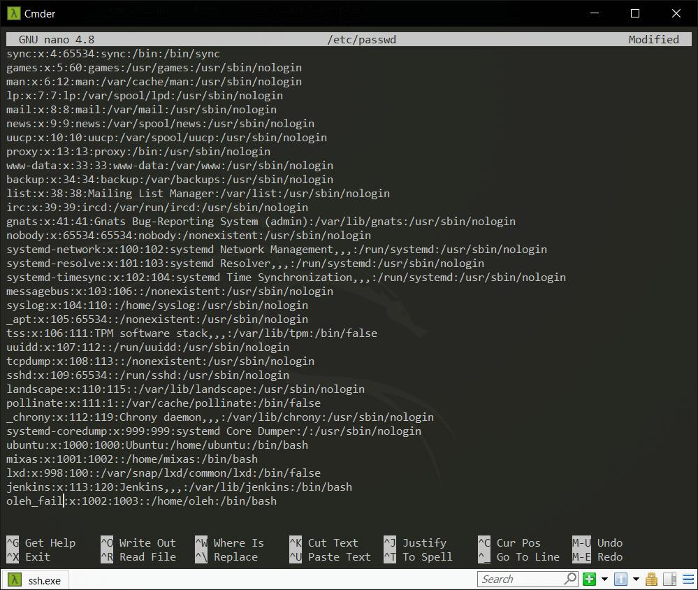
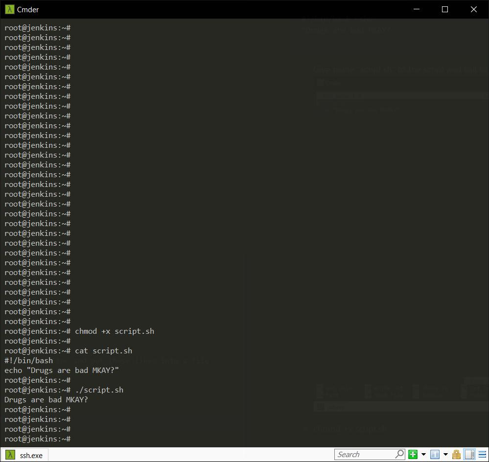

# <p align="center">**TASK 5.4**</p>

---

1. User management. Here we suppose there are at least two users, namely, root and guest.

   1.1. Create a new user user
   ```
   $ groupadd user
   $ useradd -g user -s /bin/bash -d /home/user -m user
   $ passwd user id user
   $ ls -ld /home/user
   ```
   


   1.2. Log in to the system as “user” (hint use su).
   


   1.3. Edit `/etc/passwd` to prevent user user from logging in to the system.
   

---

2. Content of `/etc/passwd` and `/etc/group`.

   2.1. Look through `/etc/passwd` and `/etc/group` (hint: use `less` or `cat`).

      * `$ cat /etc/passwd`
      

      * `$ cat /etc/group`
      

   2.2 Get data from `/etc/passwd` and `/etc/group` about users: root, guest, user (hint: filter by `grep`).

      * `$ cat /etc/passwd | grep root` `$ cat /etc/passwd | grep mixas` `$ cat /etc/passwd | grep home`
      

      * `$ cat /etc/group | grep root` `$ cat /etc/group | grep mixas` `$ cat /etc/group | grep oleh`
      

    2.3 Parse /etc/passwd and /etc/group with cut.

      * `$ cut -f1 -d: /etc/passwd`
      

      * `$ cut -f1,2 -d: /etc/passwd`
      

      * `$ cut -f1,7 -d: /etc/passwd`
      

      * `$ cut -f1 -d: /etc/group`
      

      * `$ cut -f1,2 -d: /etc/group`
      

    2.4. Try to call `less` on `/etc/shadow` and invoke

      * `$ sudo less /etc/shadow`
      

      * `$ man -k shadow`
      

      * `$ man 5 shadow`
      

---

3. Dealing with `chmod`.

    3.1. An executable script. Open your favorite editor and put these lines into a file
    ```
    #!/bin/bash echo
    “Drugs are bad MKAY?
    ```
      * Give name “script.sh” to the script and call to
      

      * `$ chmod +x script.sh`
      * `$ ./script.sh`
      

    3.2. Suppose, you have logged in to the system as guest. Create directory “testDir” in the `/tmp`; put some file into testDir and prohibit user user from visi=ng this directory (i.e. “testDir”).

    

    3.3. Test, if it possible to forbid an owner of some file to read to or write from this file. (it is posible, because i can use `sudo`)

    
