# 
__TASK 5.5__

---

0. I had some troubles with this because i chose to use Virtual Machine from GCP. But the Google Compute Engine quota module is not in the kernel. So I tryed a lot of different  ways to solve this problem. And eventually I won. In the next image you can see one of many problems.

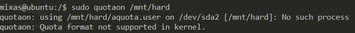

---

1. Connect to GCP Virtual Machine with SSH

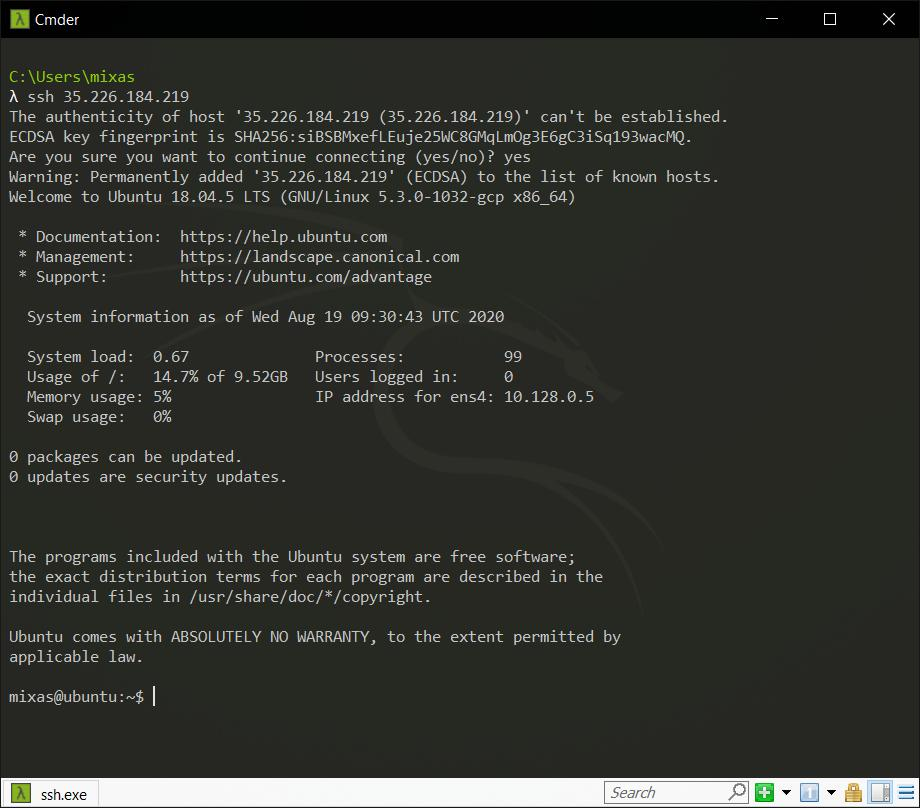

2. Download the packages I need

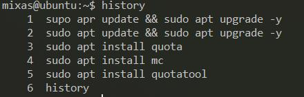

3. I have one more hard drive (sdb)

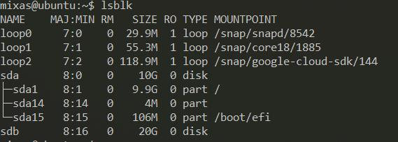

4. Create disk part(sdb1) with `$ parted`

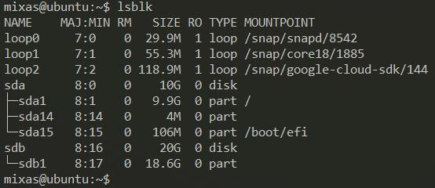

5. Create group and user "test".

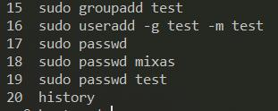

6. Open `/etc/fstab` and add one more field (previosly a created a directory `/mnt/hard`)

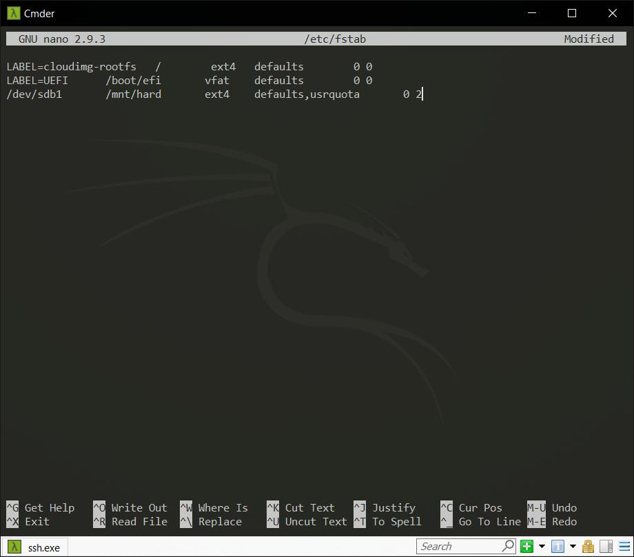

7. Check for packets.

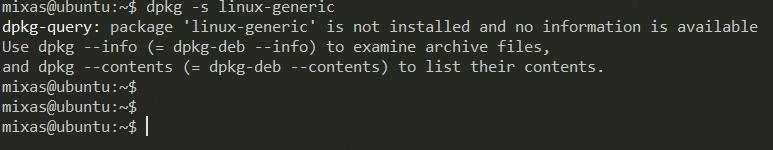

8. Install the missing linux-generic package and additional packages. (because GCP Linux kernel don't have it)

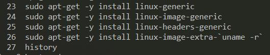

9. `$ mkfs.ext4 /dev/sdb1` and `$ mount /mnt/hard`

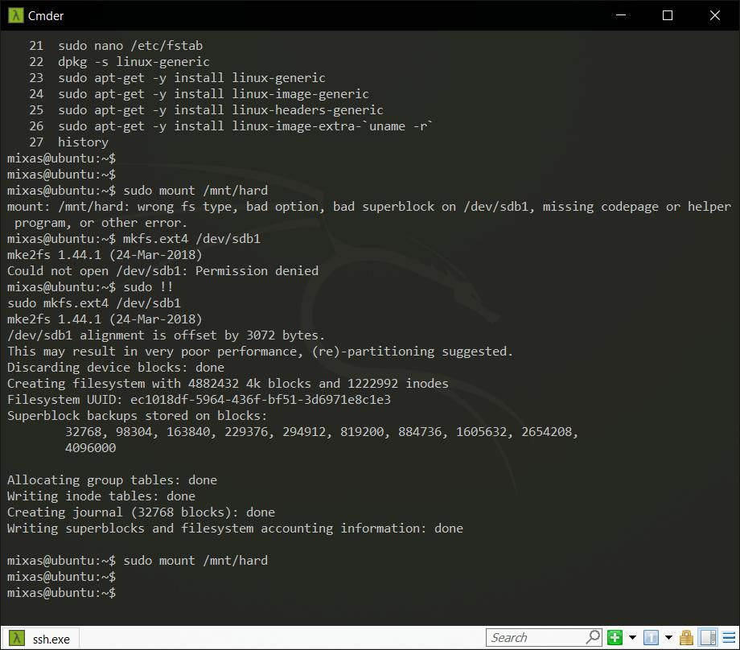

10. We need to add quota modules to start the download.

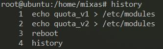

11. Check does it work

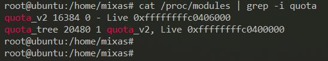

12. `$ sudo quotacheck -umc /mnt/hard`

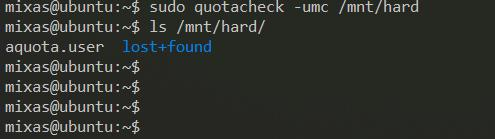

13. Edit quotas for user "test"

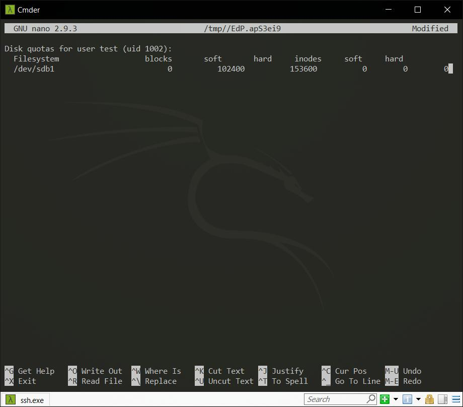

14. Check this quota for user "test"

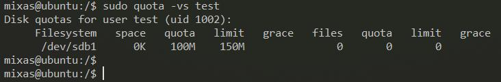

15. Enable quotas for `/mnt/hard`

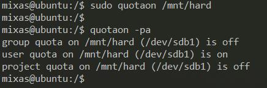

16. Download payload from GitHub (SP_Lab_1.rar weights 70 MB)

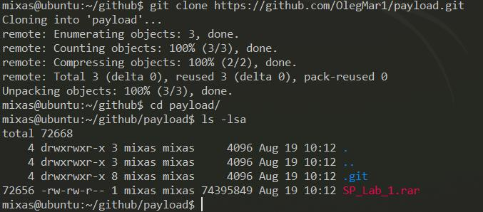

17. Copy one this file. (now I have to switch to the `cmd.exe` from the `cmder.exe` because `cmder.exe` doesn't show me `mc` window )

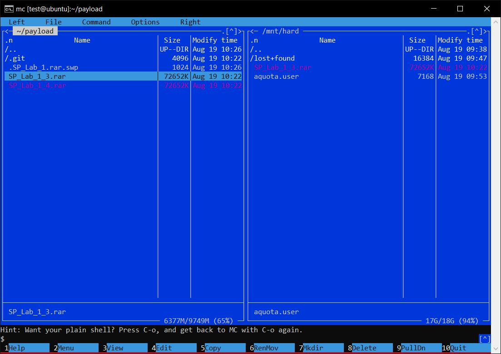

18. Try to copy thirt copy of my file (it will weights 210 MB so disk quota doesn't allow to copy)

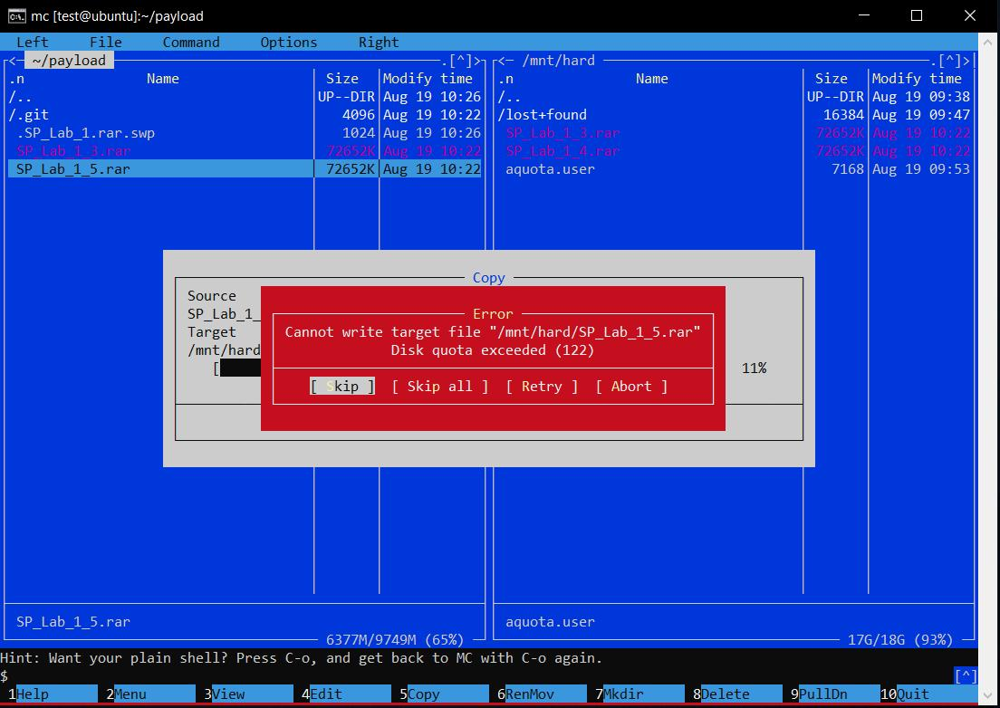

19. I choose "delete" incomplete file.

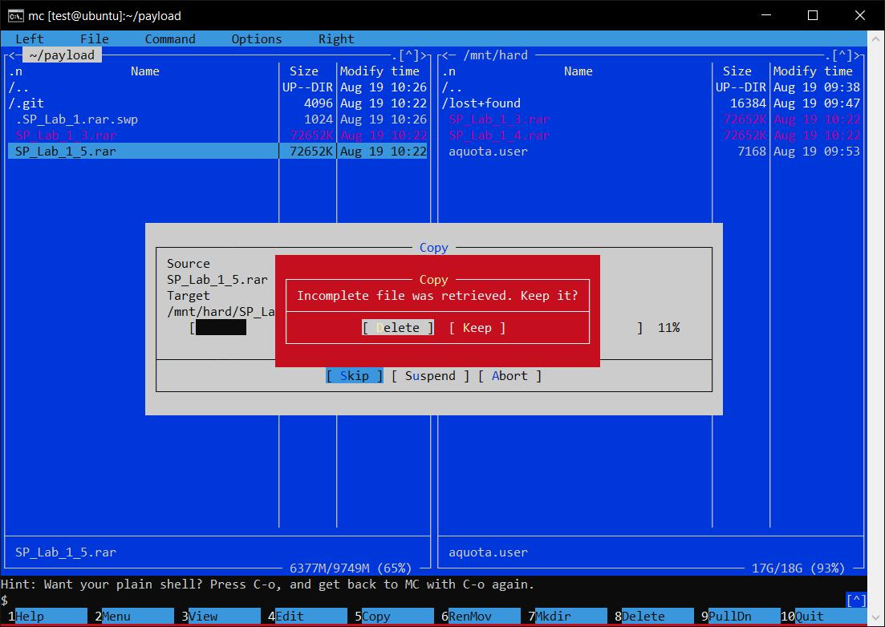

20. `$ sudo repquota /mnt/hard`

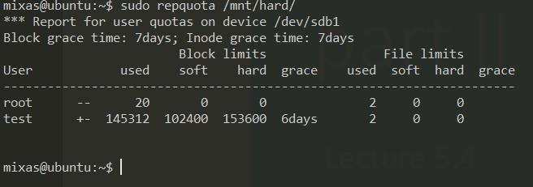

---

__
 TASK  SUCCESSFULLY COMPLEATED :)
__
