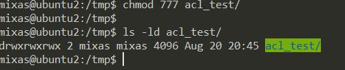

# 
__TASK 5.6__

1. Based on given in presenta=on #5.5.2 instruc=ons, turn on and set up the ACL. Cau-)on! The fact that a file system has been mounted with the “acl” flag on by default, doesn’t mean that the ACL package is installed.

* connecting with SSH to the VM

* add flag acl to `/mnt/hard` in `/etc/fstab`

* `$ tune2fs -l /dev/sdb1` (you can see flag acl in this screenshot)

* `$ blkid` and `$ sudo blkid` in the output of the second command we can see more information

* add permissions `r--` for user `test`

* login as user `test`try do something. And after that login as a user `utest` and now we can do all we need.

---

2. Log in as user `mixas`. Create in /tmp a directory called acl_test. By means of chmod, allow user `utest` to perform all possible opera=ons (rwx) with respect to acl_test. Verify that user utest is indeed capable of implemen=ng granted him (her) privileges. For example, acer  logging  in  as utest,  create  a  file  in  /tmp/acl_test,  say, utest.txt  with  the  aid  of touch. Query informa=on about the directory and file by calling to `ls -ld /tmp/acl_test` and `ls -l /tmp/acl_test`. To check ACL permisions do: `getfacl /tmp/acl_test` and `getfacl /tmp/acl_test/utest.txt`

* creating directory `acl_test` and add permissions 777 for this directory.

* creating file `utest.txt` in this directory.

* `$ ls -ld /tmp/acl_test` and `$ ls -l /tmp/acl_test`

* check ACL permissions: `getfacl /tmp/acl_test` and `getfacl /tmp/acl_test/utest.txt`

---

3. Employ ACL to block any activity except for reading, for user utest with respect to directory `/tmp/acl_test` (hint: use setfacl). `touch /tmp/acl_test/prohibited.txt` Is it possible to invoke this command? `echo “new content” > /tmp/acl_test/utest.txt`

* add flag acl to `/` in `/etc/fstab`

* add read-only permissions for user `utets`

* try to `touch /tmp/acl_test/prohibited.txt` and `echo “new content” > /tmp/acl_test/utest.txt` (first command we can't execute because we don't have write permissions, and we can't do the second command because we need execute permission without it we can't do anythink in thi directory)

* add `r-x` permissions for user `utets`

* try to `touch /tmp/acl_test/prohibited.txt` and `echo “new content” > /tmp/acl_test/utest.txt` (first command we can't execute because we don't have write permissions, but we can do the second command because we have execute permission)

* I have this interesting table and you can see what we can do with different permissions (we can't do anything without execute permission)

---

4. Consider a situation when at the ACL level user utest is allowed to have all possible privileges with respect to `/tmp/acl_test`, while no action is allowed with chmod (conventional mechanism). (Hint: repeat step 3, but given the new context)

* add rermissions `700` to our directory

* login as a `root` and ad ACL permissions `rwx` for user `uwer`

* try to `touch /tmp/acl_test/prohibited.txt` and `echo “new content” > /tmp/acl_test/utest.txt` (now we can do anything because we have all permissions)

---

5. For user utest, set default ACLs to the directory `/tmp/acl_test` which allow read-only access (hint: use the -d option of the setfacl command). Being logged in as `utest`, invoke touch to create the file `utest2.txt` in the `/tmp/acl_test` directory. Query permissions on this file using `getfacl`.

* `$ setfacl -d u:utest:r /tmp/acl_test` but i forgot to save this screenshot :) (sorry!).

* trying to create `/tmp/acl_test/utest2.txt` (a can do this, because in step 4 a set `rwx` permissions for `utest`)

---

6. Set the maximum permissions mask on the `/tmp/acl_test/utest.txt` file in such a way as to allow read-only access. Check permissions with getfacl.

* add mask `r--` for `/tmp/acl_test/utest.txt` and check it using `getfacl acl_test/utest.txt`

---

7. Delete all ACL entries relative to the `/tmp/acl_test` directory.

* `$ setfacl -b -R acl_test` and `$ getfacl acl_test` (you can see that this directory don't have any ACL permissions)

