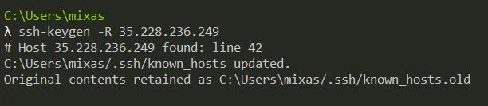

# 
__TASK 5.7__

---

1. Check the implement ability of the most frequently used OPENSSH commands in the MS Windows operating system. (Description of the expected result from the commands + screenshots: command – result should be presented)

* execute command via SSH

* send file via SSH

* Delete the known server key

---

2. Implement basic SSH settings to increase the security of the client-server connection (at least 3).

* change NAT to Host-only Adapter

* check ip on this VM (hint: 192.168.56.101)

* connecting to VM `ubuntu 2` from VM `ubuntu`

>In the next steps I increase the security of the client-server connection

__2.1__ Change the Default SSH Port

* Change port number in `/etc/ssh/sshd_config`

* `$ service sshd restart`

* connecting to this VM via SSH with port 1234

__2.2__ Enhance Linux SSH Security Using Key Pairs

* `$ ssh-kergen -t rsa` and `$ ssh-copy-id -p 1234 oleh2@192.168.56.101`

* connecting to server (now we mustn't use password)

__2.3__ Disable Password-Based Logins on Your Server

* Open `/etc/ssh/sshd_config`, find `PasswordAuthentication yes` and change to `PasswordAuthentication no`

---

3. List the options for choosing keys for encryption in SSH. Implement 3 of them.

Originally, with SSH protocol version 1 (now deprecated) only the RSA algorithm was supported. As of 2016, RSA is still considered strong, but the recommended key length has increased over time.

The SSH protocol version 2 additionally introduced support for the DSA algorithm. DSA is now considered weak and was disabled in OpenSSH 7.0.

Subsequently, OpenSSH added support for a third digital signature algorithm, ECDSA (this key format no longer uses the previous PEM file format for private keys, nor does it depend upon the OpenSSL library to provide the cryptographic implementation).

A fourth format is supported using ed25519, originally developed by independent cryptography researcher Daniel J. Bernstein.

__3.1__ RSA key pair (we can choose different bit size: 1024, 2048, 4096) It is secure (if we use bigger bit size)but also comes with an overhead in CPU time on both server and client to encrypt and decrypt with the bigger key.

* `$ ssh-keygen -t rsa -b 4096`

* `$ ssh-copy-id -p 1234 oleh2@192.168.56.101` and `$ ssh -p 1234 oleh2@192.168.56.101`

__3.2__ `ed25519` key pair (it's smaller and more secure than RSA)

* `$ ssh-keygen -t ed25519`

* `$ ssh-copy-id -p 1234 oleh2@192.168.56.101` and `$ ssh -p 1234 oleh2@192.168.56.101`

__3.3__ Elliptic Curve Digital Signature Algorithm (ECDSA) offers a variant of the Digital Signature Algorithm (DSA) which uses elliptic curve cryptography.

* `$ ssh-keygen -t ecdsa`

* `$ ssh-copy-id -p 1234 oleh2@192.168.56.101` and `$ ssh -p 1234 oleh2@192.168.56.101`

__3.4__ DSA (it's no longer supported)

* `$ ssh-keygen -t dsa`

* `$ ssh-copy-id -p 1234 oleh2@192.168.56.101` and `$ ssh -p 1234 oleh2@192.168.56.101`

* but when i try to enter to VM2 i should write my password. It happens because the new openssh version (7.0+) deprecated DSA keys and is not using DSA keys by default (not on server or client).

---

4. Implement port forwarding for the SSH client from the host machine to the guest Linux virtual machine behind NAT.

* set up NAT settings

* connecting to this VM using 8080 port.

---

5. 
