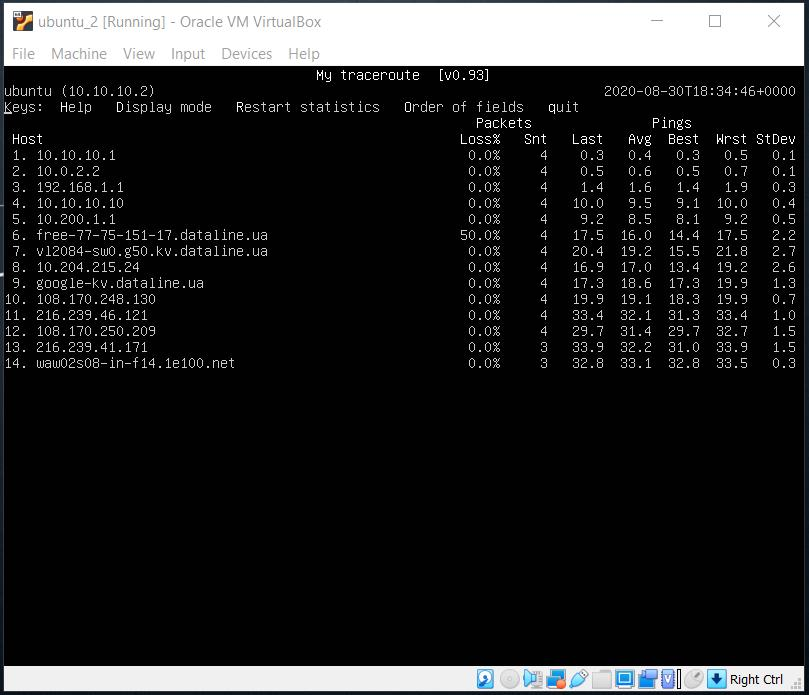

# 
 __TASK 6.1__ 

---

1. Create virtual machines connection according to figure 1:

2. VM2 has one interface (internal), VM1 has 2 interfaces (NAT and internal). Configure all network
interfaces in order to make VM2 has an access to the Internet (iptables, forward, masquerade).

  * set "Internal network" for VM2

  

  * edit `/etc/network/interfaces` for VM2

  

  * `$ ip a` for VM2

  

  * set "NAT" with port forwarding and "Internal network" for VM1

  

  

  * edit `/etc/network/interfaces` for VM1

  

  * `$ ip a` for VM1

  

  * enable ip forwarding

  

  * add some rules for `iptables` and run `$ iptables -S` to see our rules

  

  * save iptables rules using `$ sudo netfilter-persistent save`

  

---

3. Check the route from VM2 to Host.

  * `$ route -n` for VM2

  

---

4. Check the access to the Internet, (just ping, for example, 8.8.8.8).

  * `$ ping 8.8.8.8`

  

---

5. Determine, which resource has an IP address 8.8.8.8. (hint: dns.google)

  * `$ host 8.8.8.8`

  

---

6. Determine, which IP address belongs to resource epam.com

  * `$ nslookup epam.com` and `$ host epam.com` (hint: 3.214.134.159)

  

---

7. Determine the default gateway for your HOST and display routing table.

  * `ipconfig` from HOST

  

---

8. Trace the route to google.com

  * `$ mtr google.com`

  

---

# 
 __THE END__ 

