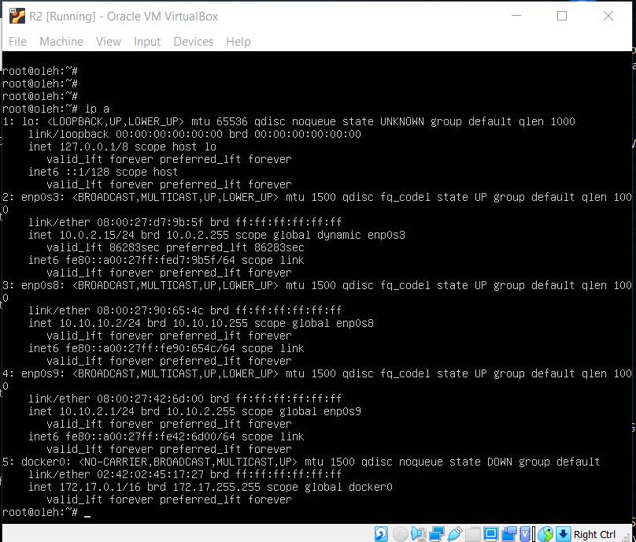

# 
__TASKK 6.2__

---

1. Use  already created internal-network for three VMs (VM1-  VM3)  .  VM1 has NAT and internal, VM2, VM3 – internal only interfaces.

  * create three VM

  

  * edit `/etc/netplan/*.yaml` for VM1 (after that run `$ netplan try` and `$ netplan apply`)

  

  * `$ ip a` for VM1

  

  * edit `/etc/netplan/*.yaml` for VM2 (after that run `$ netplan try` and `$ netplan apply`)

  

  * edit `/etc/netplan/*.yaml` for VM3 (after that run `$ netplan try` and `$ netplan apply`)

  

---

2. Install and configure DHCP server on VM1.

 2.1 __THE FIRST WAY (using dnsmasq)__

 * edit interface and listen-address in `/etc/dnsmasq.conf`

 

 * edit dhcp-range in `/etc/dnsmasq.conf`

 

 * check if it works: `$ systemctl restart dnsmasq` and `$ systemctl status dnsmasq`

 

---

  2.2 __THE SECOND WAY (using VBoxManage)__

  * stop DNSMASQ

  

  * enable dhcp for internal network "private" (range: 10.10.10.20-10.10.10.30)

  

---

3. Check VM2 and VM3  for obtaining  network addresses from DHCP server.

  3.1 __for DMSMASQ__

  * `$ ip a` from VM2

  

  * `$ ip a` from VM3

  

---

  3.2 __for VBoxManage__

  * `$ dhclient -r` and `dhclient` to give a new ip for VM2. And later`$ ip a` from VM2

  

  * `$ dhclient -r` and `dhclient` to give a new ip for VM3. And later`$ ip a` from VM3

  

  * try to ping VM1 an VM3 from VM2

  

  * try to ping VM1 an VM2 from VM3

  

---

4. Using existed network for three VMs ( from p.1) install and configure DNS server on VM1. (using DNSMASQ)

   * unkoment `prepend domain-name-servers 127.0.0.1` in `/etc/dhcp/dhclient.conf`

   

   * edit `/etc/resolv.conf`

   

---

5. Check VM2 and VM3  for gaining access to DNS server ( naming services).

  * `$ systemd-resolve --status`

  

---

6. ***Using the scheme which follows, configure dynamic routing using OSPF protocol.

  * looking at this scheme I didn't understand what I had to do. So I have done routing using OSPF a different way.

  

  * edit `/etc/netplan/*.yaml` for R1

  

  * `$ ip a` from R1 (enp0s3 = NAT; enp0s8 = INTERNAL; enp0s9 = INTERNAL)

  

  * install `quagga `and edit `/etc/quagga/daemons`

  

  * enable ip forwarding

  

  * copy some files for quagga and give them `640` permissions

  

  * change owner for this files

  

  * add `extort VTYSH_PAGER=more` in `/etc/bash.bashrc`

  

  * add `VTYSH_PAGER=more` in `/etc/environment`

  

  * next I copied R1 and rename it R2

  * run `vtysh` and after that run some commands in R1

  

  * `ip show ospf route` from R1

  

  * edit `/etc/netplan/*.yaml` for R2

  

  * `$ ip a` from R2 (enp0s3 = NAT; enp0s8 = INTERNAL; enp0s9 = INTERNAL)

  

  * run `vtysh` and after that run some commands from R2 after that run `show ip ospf route`

  

  * then i have created M1 and M2

  * edit `/etc/netplan/*.yaml` for M1

  

  * `$ ip a` from M1 (enp0s3 = INTERNAL)

  

  * edit `/etc/netplan/*.yaml` for M2

  

  * `$ ip a` from M2 (enp0s3 = INTERNAL)

  

  * ping everyone else from M1

  

  * `mtr 10.10.2.2` from M1 (10.10.2.2 = M2)

  

  * ping everyone else from M2

  

  * `mtr 10.10.1.2` from M2 (10.10.1.2 = M1)

  

  * So, ospf routing have some pitfalls, but  I think I have done it successfully. I hope you will accept this task for me! ^_^

---

__USEFUL LINKS__
* https://jonamiki.com/2020/01/29/dnsmasq-failed-to-create-listening-socket-for-port-53-address-already-in-use/
