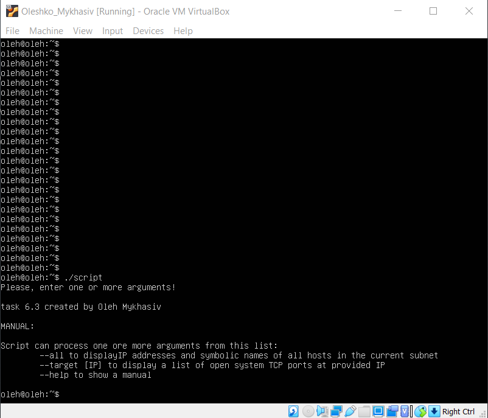
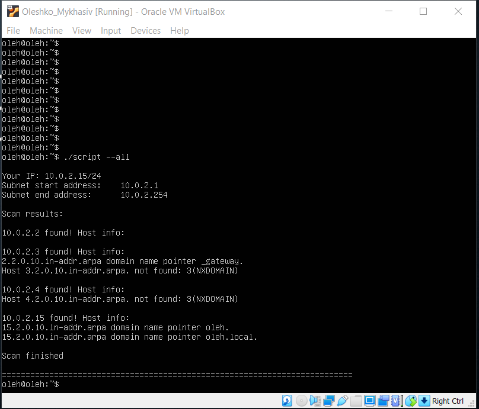
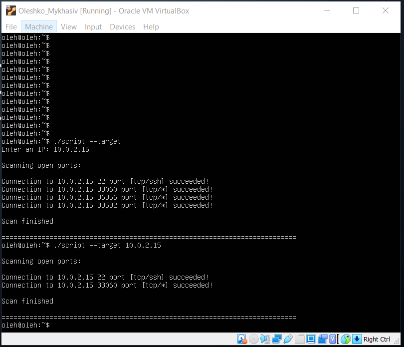
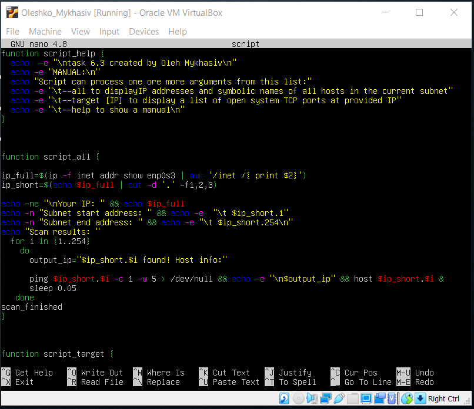
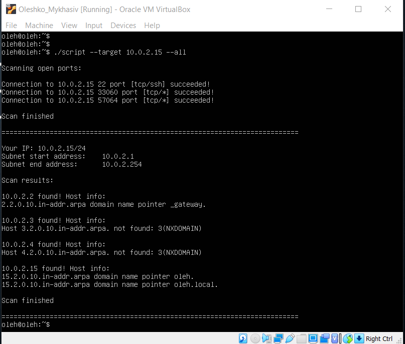

# 
 __TASK 6.3__ 

---

Create a script that uses the following keys:
1. When starting the parameters, it will display a list of possible keys and their description.

  * `$ ./script`

    

2. The --all key displays the IP addresses and symbolic names of all hosts in the current subnet

  * `$ ./script --all`

    

3. The --target key displays a list of open system TCP ports.

  * `$ ./script --target` and `$ ./script --target 10.0.2.15`

    

4. The code that performs the functionality of each of the subtasks must be placed in a separate function

  

  * also my script can accept several parameters

  

<a href="files/script" download>Go to My Script</a>

---
