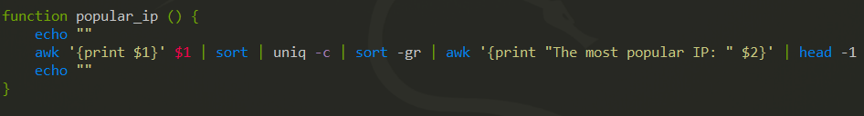

# 
 __TASK 6.4__ 

---
<a href="files/read_apache_logs" download>Go to My Script</a>

<a href="files/apache_logs.txt" download>Go to Apache logs</a>

---

0. Manual for my script

  * code

  

  * run it

  

---

1. From which ip were the most requests?

  * code

  

  * run it

  

  ---

  2. From which ip were the most requests?

    * code

    

    * run it

    

---

3. From which ip were the most requests?

  * code

  

  * run it

  

---

4. From which ip were the most requests?

  * code

  

  * run it

  

---

5. From which ip were the most requests?

  * code

  

  * run it

  

---

6. From which ip were the most requests?

  * code

  

  * run it

  
