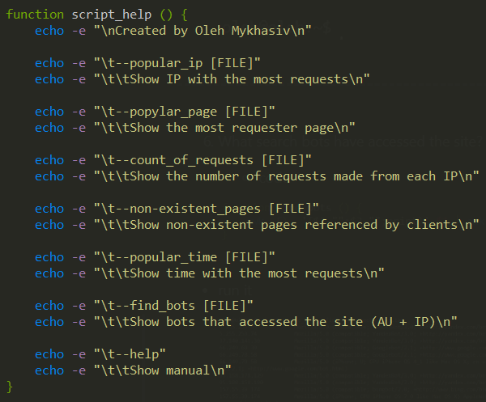
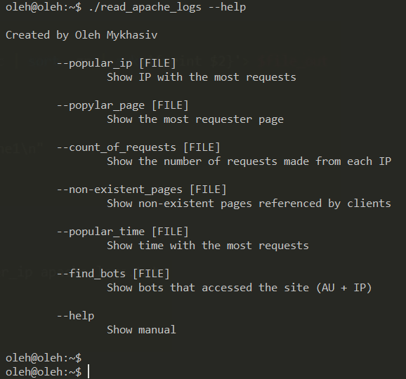

# 
 __TASK 6.4__ 

---
<a href="files/read_apache_logs" download>Go to My Script</a>

<a href="files/apache_logs.txt" download>Go to Apache logs</a>

---

0. Manual for my script

  * code

  

  * run it

  

---

1. From which ip were the most requests?

  * code

  

  * run it

  

  ---

  2. What is the most requested page?

    * code

    

    * run it

    

---

3. How many requests were there from each ip?

  * code

  

  * run it

  

---

4. What non-existent pages were clients referred to?

  * code

  

  * run it

  

---

5. What time did site get the most requests?

  * code

  

  * run it

  

---

6. What search bots have accessed the site? (AU + IP)

  * code

  

  * run it

  

---

### Thank you for this task it was a wonderful experience :)
