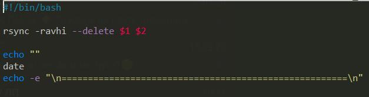
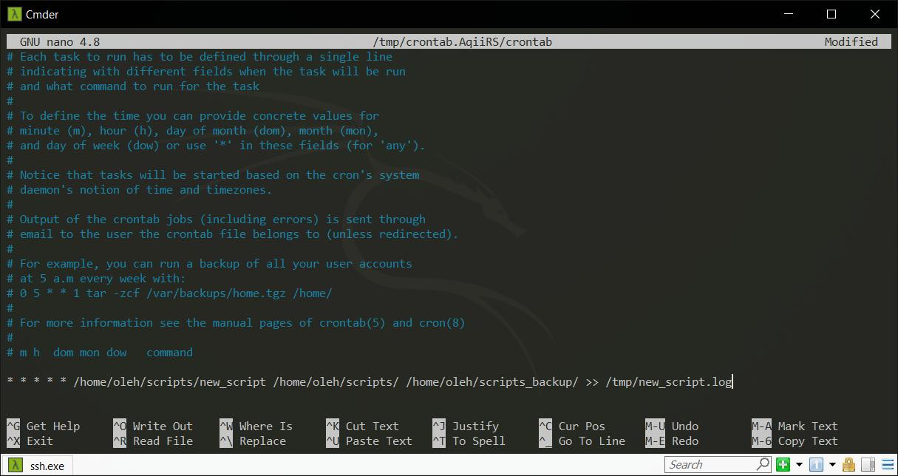
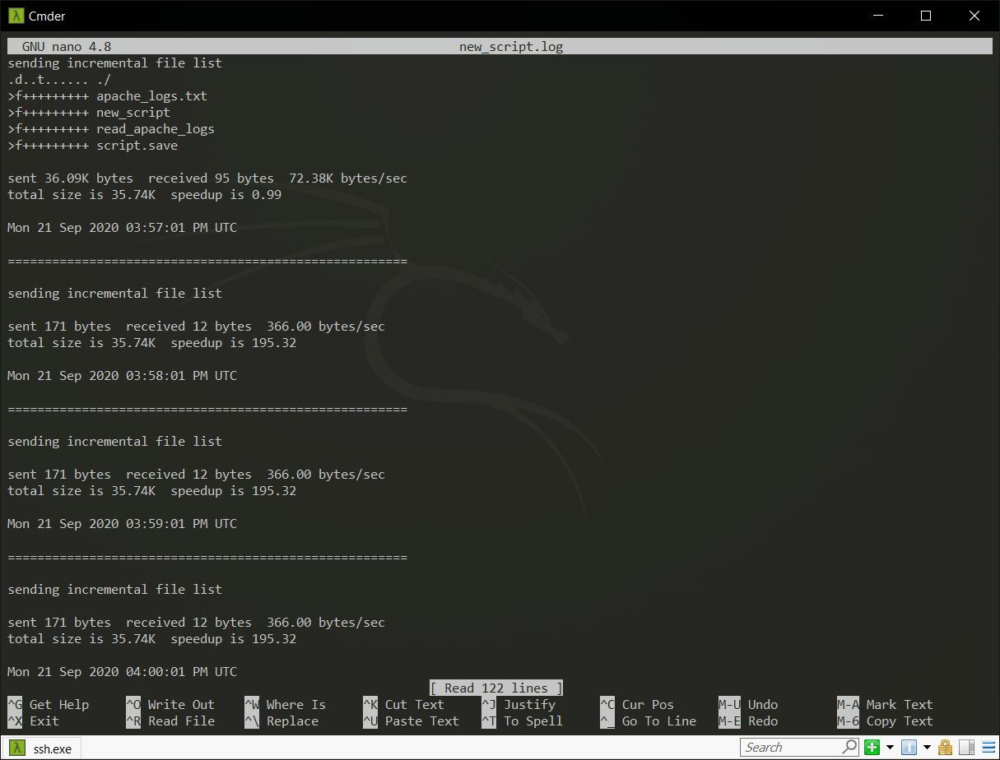
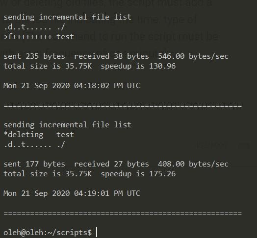
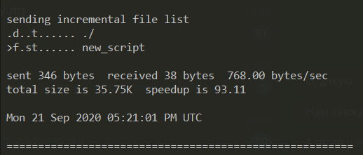

# <p align="center"> __TASK 6.5__ </p>

---

Create a data backup script that takes the following data as parameters:

1. Path to the syncing directory.

2. The path to the directory where the copies of the files will be stored.

In case of adding new or deleting old files, the script must add a corresponding entry to the log file indicating the time, type of operation and file name. [The command to run the script must be added to Crontab with a run frequency of one minute]

---

1. Create script




2. Add command to `Crontab` with a run frequency of one minute and save output information into `/tmp/new_script.log`




3. Check `/tmp/new_script.log`




4. Add file `/home/oleh/scripts/test` and after 1 minute delete it and check `/tmp/new_script.log`



5. One more screenshot: change `new_script`



---

## USEFUL INFORMATION

```
YXcstpoguax  path/to/file
|||||||||||
||||||||||╰- x: The extended attribute information changed
|||||||||╰-- a: The ACL information changed
||||||||╰--- u: The u slot is reserved for future use
|||||||╰---- g: Group is different
||||||╰----- o: Owner is different
|||||╰------ p: Permission are different
||||╰------- t: Modification time is different
|||╰-------- s: Size is different
||╰--------- c: Different checksum (for regular files), or
||              changed value (for symlinks, devices, and special files)
|╰---------- the file type:
|            f: for a file,
|            d: for a directory,
|            L: for a symlink,
|            D: for a device,
|            S: for a special file (e.g. named sockets and fifos)
╰----------- the type of update being done::
             <: file is being transferred to the remote host (sent)
             >: file is being transferred to the local host (received)
             c: local change/creation for the item, such as:
                - the creation of a directory
                - the changing of a symlink,
                - etc.
             h: the item is a hard link to another item (requires
                --hard-links).
             .: the item is not being updated (though it might have
                attributes that are being modified)
             *: means that the rest of the itemized-output area contains
                a message (e.g. "deleting")
```
