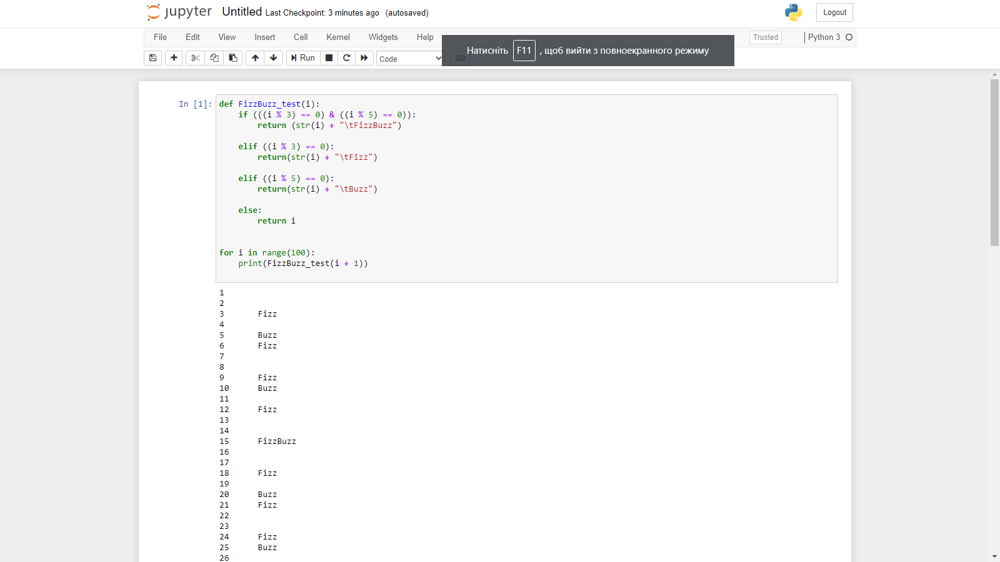
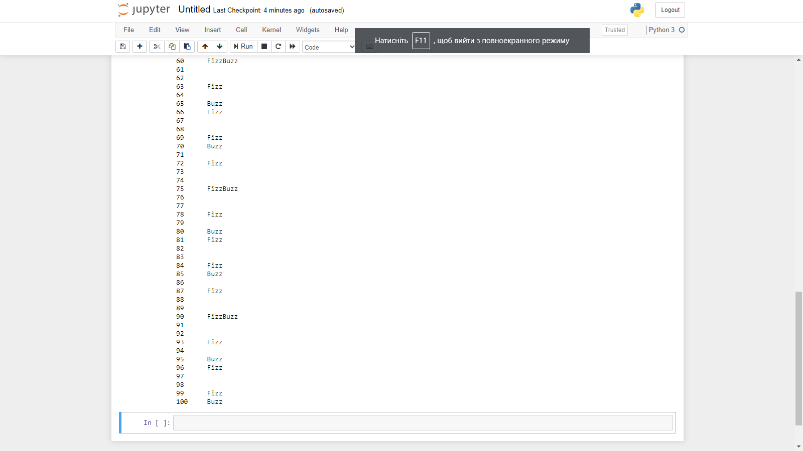
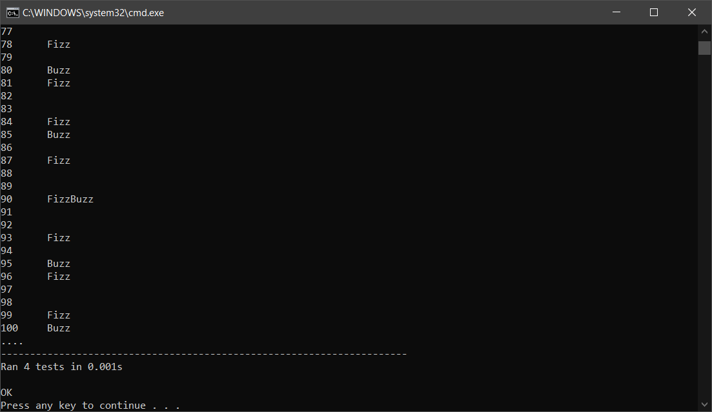
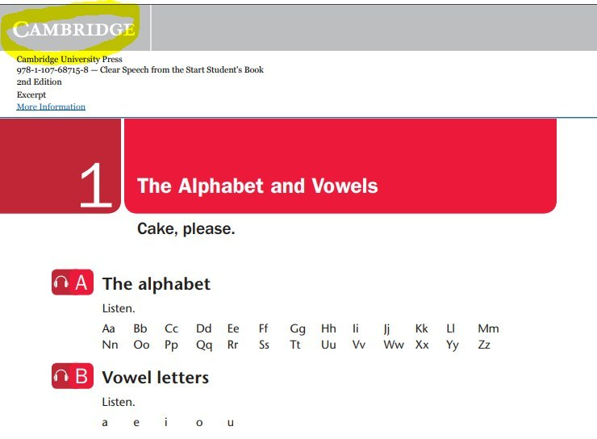
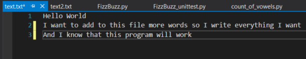
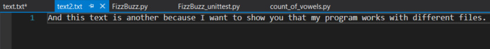
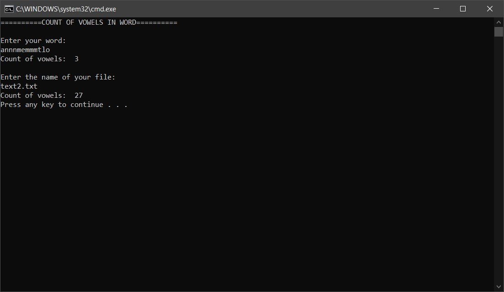

# <p align="center">__TASK 7.1__</p>

---


1. Develop fizzbuzz function for list of numbers from 1 to 100. (Check in Jupyter)

  If number divided by 3 without rest, print “Fizz”,

  If number divided by 5 without rest, print “Buzz”,

  If number divided by 3 and 5 without rest, print “FizzBuzz”.

* code

  ```
  #FizBuz function

  def FizzBuzz_test(i):
      if (((i % 3) == 0) & ((i % 5) == 0)):
          return (str(i) + "\tFizzBuzz")

      elif ((i % 3) == 0):
          return(str(i) + "\tFizz")

      elif ((i % 5) == 0):
          return(str(i) + "\tBuzz")

      else:
          return i

  for i in range(100):
      print(FizzBuzz_test(i + 1))
  ```

  * result in Jupyter

  

  ...

  

  <a href="files/FizzBuzz.py" download>Go to My Code</a>

  ---

1* Make unit tests for your new FizzBuzz function.

  * code

  ```
  import unittest
  from FizzBuzz import FizzBuzz_test

  class TestFizzBuzz(unittest.TestCase):

  	def test_number(self):
  		self.assertEqual(FizzBuzz_test(1), 1)
  		self.assertEqual(FizzBuzz_test(2), 2)
  		self.assertEqual(FizzBuzz_test(4), 4)

  	def test_fizz(self):
  		self.assertEqual(FizzBuzz_test(3), str(3) + "\tFizz")
  		self.assertEqual(FizzBuzz_test(21), str(21) + "\tFizz")

  	def test_buzz(self):
  		self.assertEqual(FizzBuzz_test(5), str(5) + "\tBuzz")
  		self.assertEqual(FizzBuzz_test(85), str(85) + "\tBuzz")

  	def test_fizzbuzz(self):
  		self.assertEqual(FizzBuzz_test(15), str(15) + "\tFizzBuzz")
  		self.assertEqual(FizzBuzz_test(75), str(75) + "\tFizzBuzz")

    if __name__ == '__main__':
      unittest.main()
  ```

  * result

  


  <a href="files/FizzBuzz_unittest.py" download>Go to My Code</a>

---

2. Develop count_vowels function for counting vowels in input text.

  * we have 5 vowels

  


  * code (it works with lower cases and upper cases)

  ```
  vowels = 'aeiouAEIOU'

  def count_vowels(word):
      count = 0
      for i in word:
          if (vowels.find(i) != -1):
              count += 1
      print("Count of vowels: ", count)

  print("==========COUNT OF VOWELS IN WORD==========\n")
  print("Enter your word:")
  word = input()

  count_vowels(word)

  #Also a want to do this task with files. So, let's start

  print("\nEnter the name of your file:")
  file_name = input()

  file = open(file_name, "r")
  count_vowels(file.read())
  file.close()
  ```

  * my .txt files

  

  


  * result

 

 

 <a href="files/count_of_vowels.py" download>Go to My Code</a>
